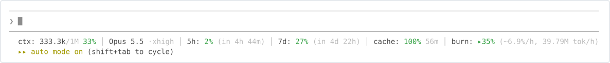

# my-claude-best

Engineering practices that people and AI coding agents both follow, plus a status line for Claude Code.

[](#license)
[](#getting-started)
[](docs/engineering/)
[](CONTRIBUTING.md)

**Navigation**

- [What it does](#what-it-does)
- [Why it is useful](#why-it-is-useful)
- [Getting started](#getting-started)
- [Project structure](#project-structure)
- [Where to get help](#where-to-get-help)
- [Maintainers and contributing](#maintainers-and-contributing)
- [License](#license)

## What it does

A practice is a folder of rules and worked examples for one kind of work, such as commits, tests or prompts. You copy the folder into your repository and add one line to your agent's instruction file. From then on, the agent reads the rules before it does that kind of work, and the people on your team read the same file.

For example, the git practice needs this one line in your `CLAUDE.md`:

```markdown
- Before any git operation, read `docs/engineering/any-language/git/git.md`.
```

With this line in your `CLAUDE.md`, the agent opens `git.md` before its first git command, and its commit titles take one form, such as `fix(orders): reject an empty cart`.

It is for teams that write code with an AI coding agent. The code examples are in Python, and in TypeScript for the React practices. The practices are Markdown, so there is nothing to build or install. Every name in the examples is invented.

The practices sit in group folders: `any-language/` for the ones whose rules work in any language (their code examples are still in Python), `python/` for the ones written for Python, and `react/` for the ones written for a React application. [docs/engineering/CLAUDE.md](docs/engineering/CLAUDE.md) says how a practice's group is picked. In the order to read them:

- [any-language/git](docs/engineering/any-language/git/) — branches, commits, pull requests and merging, with no rewriting of pushed history.
- [any-language/project-management](docs/engineering/any-language/project-management/) — how a project runs with Jira: its phases, charter, plan, work breakdown, risks, work items, SLA and rollback plan.
- [python/language](docs/engineering/python/language/) — where a constraint belongs, what in Python enforces it, and strict types a checker can read.
- [any-language/refactoring](docs/engineering/any-language/refactoring/) — how old code reaches a practice without a rewrite of the whole repository.
- [any-language/file-structure](docs/engineering/any-language/file-structure/) — where code lives in an application, and file names that say what a file holds.
- [python/logging](docs/engineering/python/logging/) — how a Python application logs through the standard `logging` module.
- [any-language/readability](docs/engineering/any-language/readability/) — how one function or class reads.
- [python/static-checks](docs/engineering/python/static-checks/) — the formatter, the linter, a strict type checker and import contracts, run the same way in hooks and in CI.
- [any-language/prompt-engineering](docs/engineering/any-language/prompt-engineering/) — the prompts that application code sends to a language model, and the call that carries them.
- [python/testing](docs/engineering/python/testing/) — which code earns a test, and how a pytest suite is laid out and written.
- [python/evals](docs/engineering/python/evals/) — how to check what a language model does in an application, with real calls on real cases.
- [react/architecture](docs/engineering/react/architecture/) — the format of a React application, its tree, where state and server data live, and the library for each job.
- [react/components](docs/engineering/react/components/) — how one component and one hook are written, and the common mistakes.
- [react/design](docs/engineering/react/design/) — how a screen looks and behaves, accessibility, and designing with Claude Code.
- [react/security](docs/engineering/react/security/) — what the browser side of an application must and must not do.
- [react/performance](docs/engineering/react/performance/) — what fast means, how to measure it, and what to fix first, with SEO in brief.

Two more parts are about Claude Code itself:

- [The status line](claude-config/statusline/) — context, usage limits, the prompt cache and each agent's progress, under the Claude Code prompt.
- [The CLAUDE.md guide](docs/claude-code/claude-md.md) — what belongs in a `CLAUDE.md` and what does not.

What it does not do:

- It is not a standard. The practices are one author's choices: change or drop any rule in your copy.
- It is not a package or a plugin. A practice is copied, not installed, and a copied folder does not update itself.
- It has no examples in languages other than Python and TypeScript.
- It is not an official Anthropic project, and Anthropic does not endorse it.

Two skills, for commits and pull requests, are planned. The `skills/` folder has none yet.

## Why it is useful

- The agent reads a practice only when the work needs it. Your `CLAUDE.md` holds one trigger line per practice, not the rules themselves, so it stays short.
- Each rule is one act at one moment, such as "before you stage" or "when you add a log call", and a new or changed rule gives its reason. An agent can follow it, a reviewer can check that it did, and a reader can tell when it does not apply.
- Every rule comes from public practice, never from what one codebase happens to do. Most practices end with the sources behind their rules.
- A good example follows every practice that governs what it shows, not only the one it illustrates. You, or your agent, will copy the example and not the rules around it, so each new practice reaches every example written after it. A line you might otherwise change or delete carries its reason in a comment, which comes along when you copy the code. A bad example names its problem and sits next to the fixed version.
- It works with any agent that reads `CLAUDE.md` or `AGENTS.md`, not only Claude Code.
- The English is plain: short sentences and common words, for readers whose first language is not English.

## Getting started

You need a git repository and a coding agent that reads `CLAUDE.md` or `AGENTS.md`.

### Adopt one practice

The steps use the git practice. Every practice is adopted the same way. Its `README.md` lists any extra step under "How to adopt".

1. Clone this repository next to your project: the green Code button on the repository page copies its address. Note the commit you copy from:

   ```bash
   git clone <address> my-claude-best
   cd my-claude-best
   git rev-parse --short HEAD
   ```

   It prints a short commit id, such as `1a2b3c4`. Put it in the message of the commit that adds the folder: you compare against it later.

2. Copy the practice folder into your project, at the same path, group folder included. The links from one practice to another count on that path:

   ```bash
   mkdir -p ../your-project/docs/engineering/any-language
   cp -R docs/engineering/any-language/git ../your-project/docs/engineering/any-language/
   ```

3. Add the trigger line to the instruction file your agent reads. Claude Code reads `CLAUDE.md`. It reads `AGENTS.md` only from version 2.1.277, and only when no `CLAUDE.md`, `.claude/CLAUDE.md` or `CLAUDE.local.md` sits in the project folder or above it. If you keep the line in `AGENTS.md` and also have a `CLAUDE.md`, add the line `@AGENTS.md` to your `CLAUDE.md`.

   ```markdown
   - Before any git operation, read `docs/engineering/any-language/git/git.md`.
   ```

   Without this line, the agent never opens the folder.

4. Ask the agent to commit a change. Before its first git command, it reads `docs/engineering/any-language/git/git.md`, and Claude Code shows that read in the session. The commit title then takes the form from section 3 of that file, such as `fix(orders): reject an empty cart`.

A copy does not update itself. To see what changed in the practice since then, run this in your clone of this repository. Put your commit id in place of `1a2b3c4`:

```bash
git pull
git log --oneline 1a2b3c4..HEAD -- docs/engineering/any-language/git
```

### Try the status line



The status line keeps the numbers you would otherwise ask Claude Code for. It shows how full the context is, how much of the 5-hour and weekly limits you have used, and how long the prompt cache stays warm. It is one Python file and two keys in `settings.json`, and it needs Python 3.9 or newer. [install.md](claude-config/statusline/install.md) sets it up by hand or with one paste, and says how to undo it.

## Project structure

```
my-claude-best/
├── docs/
│   ├── engineering/       # the practices, and CLAUDE.md: the contract for writing one
│   │   ├── any-language/  # practices whose rules work in any language, one folder each
│   │   ├── python/        # practices whose rules are written for Python, one folder each
│   │   └── react/         # practices whose rules are written for a React application, one folder each
│   └── claude-code/       # guides on instructing Claude Code
├── claude-config/
│   └── statusline/        # the status line: the script, its install guide, its images
├── skills/                # planned skills to read and copy; none yet
├── CLAUDE.local.md        # an example practices section for a project CLAUDE.md
├── CONTRIBUTING.md
├── SECURITY.md
├── TODO.md                # work planned for each practice and not done yet
├── LICENSE                # CC BY 4.0, for the text
└── LICENSE-CODE           # MIT, for the code
```

Every practice folder has the same shape. It holds a `README.md` that maps the folder and says how to adopt it, one or more rules files, and `*-example.md` files with worked examples. Run `ls -d docs/engineering/*/*/` for the practice folders.

## Where to get help

- A question, or a mistake in a practice: open an issue in this repository. Name the file and the section, and quote the line. [CONTRIBUTING.md](CONTRIBUTING.md) says what a useful issue holds.
- A security problem in the status line script: never describe it in a public issue. [SECURITY.md](SECURITY.md) says how to report it privately.

I read issues when I can. There is no set response time.

## Maintainers and contributing

I maintain this library, and the practices describe how I work. It is open source, but not open to outside contributions.

Issues are welcome. Pull requests are open only to collaborators, the people with write access to this repository. When I agree with an issue, I change the text myself, so the library keeps one voice and one style. [CONTRIBUTING.md](CONTRIBUTING.md) says what a useful issue holds and what happens to it.

## License

The text and the code have different licenses. GitHub's sidebar lists both, but the GitHub API, and any tool that reads it, reports only CC BY 4.0.

| Part | License | File |
| --- | --- | --- |
| Text, documentation and images | Creative Commons Attribution 4.0 International (`CC-BY-4.0`) | [LICENSE](LICENSE) |
| Code: the scripts in `claude-config/` and every fenced code block in the Markdown files | MIT License (`MIT`) | [LICENSE-CODE](LICENSE-CODE) |

Both are © 2026 The my-claude-best authors: the author and every collaborator whose commit is in the history.

You can use, change and share both, including commercially.

- When you share the text, or a folder you copied, keep the notices, credit the author, link the license, and say if you changed it.
- Keep the MIT copyright and permission notice in all copies or substantial portions of the code.

To credit a folder you copied, put this line at the top of its `README.md`, with the folder's name filled in:

> This work, "the folder's name", is adapted from "my-claude-best" by a6m1n (https://github.com/a6m1n/my-claude-best), used under CC BY 4.0 (https://creativecommons.org/licenses/by/4.0/).
