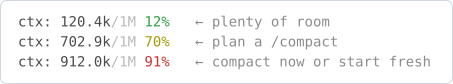
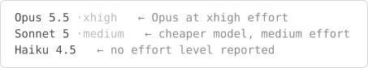
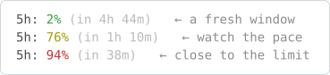
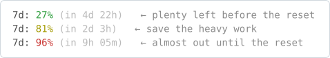
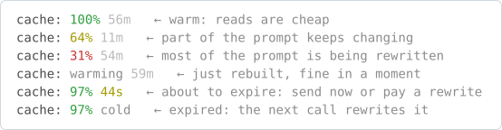
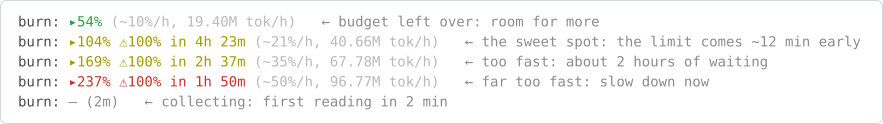
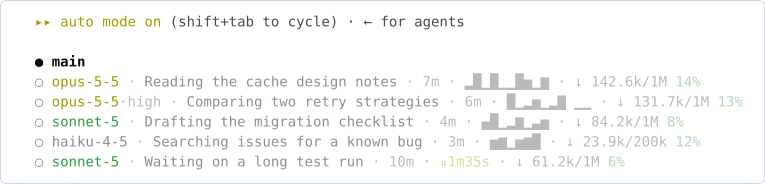

# Status line

A free Claude Code status line that keeps four things in view under the prompt: how full the context is, how much of your usage limits is left, whether the prompt cache is warm, and whether your pace fits the 5-hour limit. A second part redraws the agent panel, so every running subagent shows its model, what it is doing and how much it has used.


The pictures on this page are drawn from the script's own output on invented numbers; none of them is a screenshot. The `auto mode on` line under the status line stands in for Claude Code's own footer.

It is one Python file, [statusline.py](statusline.py), and two keys in `settings.json`, with no packages beyond the standard library. Set it up [by hand in four steps](#set-it-up-by-hand), or [with one paste](#install-with-one-paste) into Claude Code.

## What it gives you

Claude Code has most of these numbers, but you see them only when you go and ask for them. The line keeps them in front of you on every message, and that changes how you work:

- Use the whole 5-hour budget without hitting the limit an hour early. `burn` works like a speedometer: it shows where your budget will be when the window resets, if you keep the current pace.
- Stop paying for a cold cache. A message that reads the prompt from a warm cache costs a small fraction of one that has to write it again, and the countdown tells you how long you can step away.
- Compact when you choose. `ctx` shows the window filling up, before Claude Code compacts by itself and may lose early details.
- See a lockout coming. `5h` and `7d` show how much of each limit is gone and when it resets.
- Spot the stuck agent and the expensive one. Each agent row shows its model, its task and a pause timer.
- Know what you are paying for. The model and the effort level stay in view, so a quick question does not run at top effort on an expensive model by accident.

The script reads only local files and makes no network calls; see [what it does on your machine](#what-the-script-does-on-your-machine).

## What each segment shows

### `ctx`: how full the context is



`ctx: 333.3k/1M 33%` is the number of tokens in the context window now, the window size, and the share used. It turns yellow at 60% and red at 85%. Every message sends the whole context again, so a fuller window costs more per message. Near the limit, Claude Code compacts by itself: it clears old tool outputs, then summarizes the conversation, and details from early on may be lost. Yellow is a good moment to run `/compact` yourself, at a point you choose and with a focus (`/compact focus on the API changes`); red means compact now or start a new session.

### Model and effort



`Opus 5.5 ·xhigh` is the model the session runs on and its effort level: `low`, `medium`, `high`, `xhigh` or `max`. Effort is how much work the model puts into an answer: more effort helps on hard tasks and uses more tokens. With both in view you do not ask a quick question at top effort on an expensive model by accident. When Claude Code sends no effort level, the segment shows the model alone.

### `5h`: the 5-hour usage limit



`5h: 2% (in 4h 44m)` is the share of your 5-hour usage limit used so far, and the time until the window resets. It turns yellow at 70% and red at 90%. At 100% you are limited until the reset, so red means finish the current step and leave the rest for later. Cmd-click or Ctrl-click the segment to open the usage page, in terminals that support links.

### `7d`: the weekly limit



`7d: 27% (in 4d 22h)` is the same for the weekly limit, with the same colors. It resets less often, so a red `7d` with days left before the reset means: keep the expensive model for the work that needs it.

### `cache`: keep the cache warm



Every message you send carries the whole conversation so far, plus the system prompt, your `CLAUDE.md` files and the tool definitions. Prompt caching lets the API keep that long start of the prompt for 5 minutes or 1 hour, and the next message that starts the same way reads it from the cache instead of processing it again.

The price difference is large. On the API price list, a token read from the cache costs a tenth of a normal input token or less, while writing the cache costs 1.25 times the normal price (5-minute cache) or 2 times (1-hour cache). So for the cached part of the prompt, a message sent after the cache has gone cold costs 12.5 to 80 times more than the same message a minute earlier, depending on the model and the cache length. In a long session, the cached part is most of the prompt.

`cache: 100% 56m` tells you how well the cache works and how long it keeps working:

- The percentage is the share of cached tokens that were read rather than written again, over the last 10 API calls. It is green from 75%, yellow from 50%, red below. A number that stays low for many calls means something keeps changing the start of the prompt: an edited `CLAUDE.md`, a skill or MCP server added mid-session, a model switch. Right after a new session or a cold cache the number dips by itself and climbs back as the next calls read the cache. `warming` replaces a red number when the last call wrote at least as much cache as it read, as right after a rebuild.
- The time is how long the cache stays warm. Every call starts the clock again, and the script reads from the transcript whether the session uses the 5-minute or the 1-hour cache. The time turns yellow in the last minute, and `cold` means the cache has expired: the next message pays to write the whole prefix again. If you step away, come back before it goes cold, or expect the first message back to cost more.

### `burn`: the speedometer for your 5-hour limit



Claude Code tells the status line only how much of the 5-hour limit is used right now. It does not say whether your pace will run you into the limit before the window resets. `burn` answers that. The script keeps a short history of the used percentage for each session, fits a line through the last hour of it to get your pace, and projects that pace to the reset:

```text
projected share at the reset = used now + pace × hours until the reset
```

Take this reading, with 8% of the 5-hour limit used and the window resetting in 4h 35m:

```text
burn: ▸104% ⚠100% in 4h 23m (~21%/h, 40.66M tok/h)
```

| Part | What it means |
|---|---|
| `▸104%` | At this pace the budget ends the window at 104%: 8% now, plus 21% per hour for the 4h 35m left (4.58 hours), gives 104.2%, shown as 104%. |
| `⚠100% in 4h 23m` | At this pace you reach the limit in 4h 23m, about 12 minutes before the reset. It appears only when the projection is 100% or more. |
| `~21%/h` | Your pace: the share of the 5-hour budget you use per hour. |
| `40.66M tok/h` | The tokens this session processes per hour, cache reads included. It counts this session only; the percentages cover all your sessions. |

How to read the number:

| Reading | What it means | What to do |
|---|---|---|
| below 100% (green) | You will not use the whole budget before the reset. | There is room for more: a stronger model, higher effort, more agents at once. |
| 100% to about 120% | The sweet spot: you use the whole budget, and the limit comes shortly before the reset. | Keep this pace. |
| about 120% to 200% | The limit comes well before the reset, and you wait for the rest of the window. | Slow down: fewer agents at once, a cheaper model for simple steps. |
| 200% and more (red) | More than twice the budget. | Slow down now, or plan for a long pause. |
| `— (2m)` | Still collecting: the first reading needs three minutes of history, and `(2m)` is the time until it. | Wait. |

The script colors everything from 100% to 200% yellow. In the sweet spot, yellow means you are right on budget, not that something is wrong.

`burn` is a straight-line forecast. A burst of parallel agents pushes it up and a quiet stretch pulls it down, so read it as a trend. The limit is shared by all your sessions, so the percentages include what other sessions spend.

`5h`, `7d` and `burn` appear only on a Pro or Max plan: Claude Code sends usage limits to the status line for those plans only, and only after the first answer in a session. In a narrow terminal the line drops the `(in …)` times and the `burn` details.

## The agent panel

The agent panel under the footer lists the subagents that are running. The script redraws each row, so you see at a glance which agents run on an expensive model, what each one is doing, and which one has stopped moving.



The five agent rows are what the script prints for invented agents; the footer line, the `● main` row and the `○` marks stand in for Claude Code's own panel.

Each row shows the model and its effort, what the agent is doing right now, how long it has run, a small chart of its token use, and how full its context is. The model color shows the cost: yellow for Opus and Fable, green for Sonnet, gray for Haiku. A flat stretch in the chart means the agent is not using tokens, usually during a tool call. When the pause lasts 40 seconds or more, the flat end of the chart turns into a yellow `⏸` with the pause length, which is how you spot an agent that is stuck.

## What the script does on your machine

It reads the JSON that Claude Code sends on stdin, and the last 2 MB of the session transcript to count cache hits and tokens per hour. It writes two small files per session to your temp folder, `claude_statusline_burn_<session>.json` and `claude_statusline_agents_<session>.json`, because `burn` and the pause timer need a history that Claude Code does not keep. It makes no network calls. It runs with your user's rights on every refresh, so read it before you install it: it is one file.

## Set it up by hand

You need Python 3.9 or newer (`python3 --version`) and a clone of this repository. Run the commands from the clone's root, all in one terminal. They are for macOS, Linux and Git Bash; on Windows, use the [one-paste route](#install-with-one-paste).

1. **Run the script once from the clone.** Claude Code shows an empty line when a status line command fails, so first check that Python runs the file:

   ```sh
   echo '{"model": {"display_name": "Opus"}}' | python3 claude-config/statusline/statusline.py
   ```

   It prints `ctx: — │ Opus │ cache: —`, with colors. The dashes are fine: a real session fills them in.

2. **Copy it to `~/.claude/statusline.py`.** `~/.claude/` holds your own Claude Code settings for every project, so the status line follows you everywhere. If you already have a file with that name, the second line keeps a dated copy of it.

   ```sh
   stamp=$(date +%Y%m%d-%H%M%S)
   if [ -e ~/.claude/statusline.py ]; then cp ~/.claude/statusline.py ~/.claude/statusline.py.bak-$stamp; fi
   cp claude-config/statusline/statusline.py ~/.claude/statusline.py
   ```

   Check it: run the command from step 1 on `~/.claude/statusline.py`. It prints the same line.

3. **Add two keys to `~/.claude/settings.json`.** The file may already hold your permissions, hooks and model choice, so keep a dated copy first, then merge the keys into it; never replace the whole file.

   ```sh
   if [ -e ~/.claude/settings.json ]; then cp ~/.claude/settings.json ~/.claude/settings.json.bak-$stamp; fi
   ```

   Open `~/.claude/settings.json` in an editor and paste the two keys inside the outer `{ }`, with a comma after the key before them. If `statusLine` is already there, replace its value instead of adding a second one. If the file does not exist, create it with just this block. To use the status line in one project only, put the keys in that project's `.claude/settings.json` instead.

   ```json
   {
     "statusLine": {
       "type": "command",
       "command": "python3 ~/.claude/statusline.py",
       "refreshInterval": 300
     },
     "subagentStatusLine": {
       "type": "command",
       "command": "python3 ~/.claude/statusline.py --subagents"
     }
   }
   ```

   - `statusLine.command` runs in a shell after every message, so `~` works. The script prints one line, and Claude Code shows it under the prompt.
   - `refreshInterval` is in seconds. Claude Code already redraws the line after each message; the extra redraw every 5 minutes keeps the reset times and the cache countdown current while you are away.
   - `subagentStatusLine` runs the same file with `--subagents`. Claude Code sends the list of running agents, and the script returns one redrawn row per agent. A row it cannot redraw keeps the default look.

   Then check that the file is still valid JSON. A broken file turns off every setting in it, not only the status line:

   ```sh
   python3 -m json.tool ~/.claude/settings.json > /dev/null && echo ok
   ```

   Anything but `ok` means the merge broke the file: fix it, or copy the dated backup back.

4. **Send any message in Claude Code.** The line appears after the next answer. To see the agent rows, ask Claude to do a task with a subagent: each row now starts with the model. To remove it all, delete the two keys, or copy the dated backups back. If nothing appears, see [below](#if-nothing-appears).

## Install with one paste

Clone [this repository](../../) (the green Code button on its page gives the address), open a terminal in the clone, start `claude`, and paste the prompt below (the copy button sits in the corner of the block). No clone? Start `claude` anywhere and paste the prompt; when it asks for the script, give it the raw address of [statusline.py](statusline.py), which the Raw button on that file's page opens. Claude Code checks everything first, then backs up your files, copies the script, merges the two keys and shows you each change. It asks before it replaces anything you already have, and Claude Code itself asks you to approve each command and file edit: read them before you approve. When it is done, send one message and look under the prompt; if nothing appears, see [below](#if-nothing-appears). This route has not been tested on Windows.

```text
Install the status line from claude-config/statusline/ in this repository into my global Claude Code config. Change nothing in ~/.claude/ except ~/.claude/statusline.py, ~/.claude/settings.json and the backups named below: not CLAUDE.md, skills, agents, hooks or any other setting. CLAUDE.local.md in this repository is an example for other projects; ignore it for this task. Follow the steps in order, and stop to ask me when a step says so. If a step fails after you have changed a file, copy that file's backup back before you stop.

1. Find the script: claude-config/statusline/statusline.py under the current directory. If it is not there, stop and ask me for the path to statusline.py or for its raw download URL. Download a URL with `curl -fsSL <url> -o <a temp file>`, never with a web-fetch tool, which returns a summary instead of the file; then show me its line count and its first and last lines.
2. Read the whole script and tell me in two lines what it reads and writes on my machine.
3. Check Python: run `python3 --version`. If it fails or prints no version, try `python --version`, then `py -3 --version`, and use the first one that works as PYTHON below. It must be 3.9 or newer; if not, stop and tell me.
4. Test the script where it is: pipe '{"model": {"display_name": "Opus"}}' into `PYTHON <path from step 1>` and show me the output. It must print one line that starts with "ctx:". If it fails, stop and show me the error.
5. Check the settings before you change anything: if ~/.claude/settings.json exists and does not parse as JSON, stop and show me the parse error. If statusLine or subagentStatusLine is already set, show me the current value and ask whether to replace it.
6. Make a timestamp once, in the form YYYYMMDD-HHMMSS, and use it for every backup. Never overwrite an existing file with a backup; if a backup name is taken, add -2, -3 and so on.
7. Copy the script to ~/.claude/statusline.py. If that file exists and is identical, skip the copy. If it exists and differs, show me the first lines of both files and ask before you replace it; if I agree, first copy the old one to ~/.claude/statusline.py.bak-<timestamp>. If it is a symlink, write through it to the file it points to and keep the link.
8. If ~/.claude/settings.json exists, copy it to ~/.claude/settings.json.bak-<timestamp>. Then merge these two keys into it, or create it with just these keys, and keep every other key exactly as it is. If it is a symlink, edit the file it points to in place and keep the link.
   "statusLine": {"type": "command", "command": "python3 ~/.claude/statusline.py", "refreshInterval": 300}
   "subagentStatusLine": {"type": "command", "command": "python3 ~/.claude/statusline.py --subagents"}
   If PYTHON from step 3 is not python3, use it in both commands instead of python3. Use forward slashes in paths.
9. Parse the settings file again to prove it is valid JSON, and show me the diff against the backup.
10. Finish with what changed, the exact paths of the backups you made, and how to undo it: delete the two keys, or copy the backups back. Then tell me to send one message and look for the line under the prompt, and to run a task with a subagent to see the agent rows.
```

## If nothing appears

- Run `claude --debug`: it logs the script's errors and its exit code.
- Accept the workspace trust prompt. Claude Code runs no status line in a folder you have not trusted.
- The `disableAllHooks` setting turns the status line off, and so does `allowManagedHooksOnly` when your organization sets it.
- Claude Code may find a different `python3` than your terminal does. Run `command -v python3` and put that full path in `command` in place of `python3`.
- If the agent rows keep their default look, update Claude Code: older versions do not send the model of each agent.

## Sources

- Anthropic, "Customize your status line": https://code.claude.com/docs/en/statusline (the stdin fields, `refreshInterval`, `subagentStatusLine` and its one-row-per-agent output, ANSI colors and OSC 8 links, the Windows shell, the troubleshooting list)
- Anthropic, "How Claude Code works": https://code.claude.com/docs/en/how-claude-code-works (what happens when the context fills up, and `/compact` with a focus)
- Anthropic, "Prompt caching": https://platform.claude.com/docs/en/build-with-claude/prompt-caching (the cache lifetimes, and the read and write prices against the normal input price)
- Anthropic, "Plugins reference": https://code.claude.com/docs/en/plugins-reference (a plugin can set `subagentStatusLine` but not `statusLine`, which is why this is a file and two settings keys, not a plugin)
