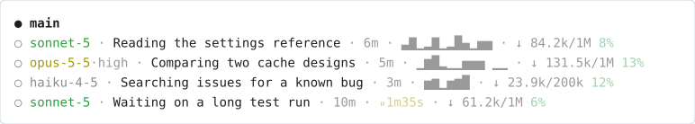

# Status line

A Claude Code status line that shows, under the prompt, how full the context is, how much of your usage limits you have used, whether the prompt cache is warm, and whether your current pace fits in the 5-hour limit. A second part redraws the rows of the agent panel, so each running subagent shows its model, what it is doing and how many tokens it uses.


It is one Python file, [statusline.py](statusline.py), and two keys in `settings.json`, with no packages beyond the standard library. Set it up [by hand in four steps](#set-it-up-by-hand), or [with one paste](#install-with-one-paste) into Claude Code.

## What each segment shows

| Segment | Example | What it means | Colors |
|---|---|---|---|
| `ctx` | `ctx: 293.9k/1M 29%` | Tokens in the context window now, the window size, and the share used. | green below 60%, yellow below 85%, red from 85% |
| model | `Opus 5.5 ·xhigh` | The model and its effort level. | none |
| `5h` | `5h: 49% (in 56m)` | Share of the 5-hour usage limit used, and the time until it resets. Cmd-click or Ctrl-click opens the usage page in terminals that support links. | green below 70%, yellow below 90%, red from 90% |
| `7d` | `7d: 22% (in 5d 0h)` | The same for the weekly limit. | same as `5h` |
| `cache` | `cache: 98% 59m` | Over the last 10 API calls, the share of cached prompt tokens that were read rather than written again; then the time until the cache expires. `warming` shows right after a rebuild. `cold` means the cache has expired, and the next call pays full price to write it again. | green from 75%, yellow from 50%, red below |
| `burn` | `burn: ▸57% (~9.0%/h, 12.88M tok/h)` | Where the 5-hour budget will be at the reset if the current pace holds. In brackets: the pace in percent per hour, and this session's tokens per hour. `⚠100% in 42m` appears when the limit comes before the reset. `— (2m)` means the line is still collecting its first three minutes of data. | green below 100%, yellow below 200%, red from 200% |

`5h`, `7d` and `burn` appear only on a Pro or Max plan: Claude Code sends usage limits to the status line for those plans only, and only after the first answer in a session. In a narrow terminal the line drops the `(in …)` times and the `burn` details.

`burn` is a straight-line forecast. A burst of parallel agents pushes it up and a quiet stretch pulls it down, so read it as a trend. The limit is shared by all your sessions, so the percentages include what other sessions spend; `tok/h` counts this session only.

## The agent panel



This is not a screenshot. The four agent rows are what the script prints for invented agents, drawn as an image; the `● main` row and the `○` marks stand in for Claude Code's own panel.

Each running subagent gets one row: its model and effort, what it is doing right now, how long it has run, a small chart of its token use, and how full its context is. The model color shows the cost: yellow for Opus and Fable, green for Sonnet, gray for Haiku. A flat stretch in the chart means the agent is not using tokens, usually during a tool call. When the pause lasts 40 seconds or more, the flat end of the chart turns into a yellow `⏸` with the pause length, which is how you spot an agent that is stuck.

## What the script does on your machine

It reads the JSON that Claude Code sends on stdin, and the last 2 MB of the session transcript to count cache hits and tokens per hour. It writes two small files per session to your temp folder, `claude_statusline_burn_<session>.json` and `claude_statusline_agents_<session>.json`, because `burn` and the pause timer need a history that Claude Code does not keep. It makes no network calls. It runs with your user's rights on every refresh, so read it before you install it: it is one file.

## Set it up by hand

You need Python 3.9 or newer (`python3 --version`) and a clone of this repository. Run the commands from the clone's root, all in one terminal. They are for macOS, Linux and Git Bash; on Windows, use the [one-paste route](#install-with-one-paste).

1. **Run the script once from the clone.** Claude Code shows an empty line when a status line command fails, so first check that Python runs the file:

   ```sh
   echo '{"model": {"display_name": "Opus"}}' | python3 claude-config/statusline/statusline.py
   ```

   It prints `ctx: — │ Opus │ cache: —`, with colors. The dashes are fine: a real session fills them in.

2. **Copy it to `~/.claude/statusline.py`.** `~/.claude/` holds your own Claude Code settings for every project, so the status line follows you everywhere. If you already have a file with that name, the second line keeps a dated copy of it.

   ```sh
   stamp=$(date +%Y%m%d-%H%M%S)
   if [ -e ~/.claude/statusline.py ]; then cp ~/.claude/statusline.py ~/.claude/statusline.py.bak-$stamp; fi
   cp claude-config/statusline/statusline.py ~/.claude/statusline.py
   ```

   Check it: run the command from step 1 on `~/.claude/statusline.py`. It prints the same line.

3. **Add two keys to `~/.claude/settings.json`.** The file may already hold your permissions, hooks and model choice, so keep a dated copy first, then merge the keys into it; never replace the whole file.

   ```sh
   if [ -e ~/.claude/settings.json ]; then cp ~/.claude/settings.json ~/.claude/settings.json.bak-$stamp; fi
   ```

   Open `~/.claude/settings.json` in an editor and paste the two keys inside the outer `{ }`, with a comma after the key before them. If `statusLine` is already there, replace its value instead of adding a second one. If the file does not exist, create it with just this block. To use the status line in one project only, put the keys in that project's `.claude/settings.json` instead.

   ```json
   {
     "statusLine": {
       "type": "command",
       "command": "python3 ~/.claude/statusline.py",
       "refreshInterval": 300
     },
     "subagentStatusLine": {
       "type": "command",
       "command": "python3 ~/.claude/statusline.py --subagents"
     }
   }
   ```

   - `statusLine.command` runs in a shell after every message, so `~` works. The script prints one line, and Claude Code shows it under the prompt.
   - `refreshInterval` is in seconds. Claude Code already redraws the line after each message; the extra redraw every 5 minutes keeps the reset times and the cache countdown current while you are away.
   - `subagentStatusLine` runs the same file with `--subagents`. Claude Code sends the list of running agents, and the script returns one redrawn row per agent. A row it cannot redraw keeps the default look.

   Then check that the file is still valid JSON. A broken file turns off every setting in it, not only the status line:

   ```sh
   python3 -m json.tool ~/.claude/settings.json > /dev/null && echo ok
   ```

   Anything but `ok` means the merge broke the file: fix it, or copy the dated backup back.

4. **Send any message in Claude Code.** The line appears after the next answer. To see the agent rows, ask Claude to do a task with a subagent: each row now starts with the model. To remove it all, delete the two keys, or copy the dated backups back. If nothing appears, see [below](#if-nothing-appears).

## Install with one paste

Clone this repository, open a terminal in the clone, start `claude`, and paste the prompt below (the copy button sits in the corner of the block). Claude Code checks everything first, then backs up your files, copies the script, merges the two keys and shows you each change. It asks before it replaces anything you already have, and Claude Code itself asks you to approve each command and file edit: read them before you approve. When it is done, send one message and look under the prompt; if nothing appears, see [below](#if-nothing-appears). This route has not been tested on Windows.

```text
Install the status line from claude-config/statusline/ in this repository into my global Claude Code config. Change nothing in ~/.claude/ except ~/.claude/statusline.py, ~/.claude/settings.json and the backups named below: not CLAUDE.md, skills, agents, hooks or any other setting. CLAUDE.local.md in this repository is an example for other projects; ignore it for this task. Follow the steps in order, and stop to ask me when a step says so. If a step fails after you have changed a file, copy that file's backup back before you stop.

1. Find the script: claude-config/statusline/statusline.py under the current directory. If it is not there, stop and ask me for the path to statusline.py or for its raw download URL. Download a URL with `curl -fsSL <url> -o <a temp file>`, never with a web-fetch tool, which returns a summary instead of the file; then show me its line count and its first and last lines.
2. Read the whole script and tell me in two lines what it reads and writes on my machine.
3. Check Python: run `python3 --version`. If it fails or prints no version, try `python --version`, then `py -3 --version`, and use the first one that works as PYTHON below. It must be 3.9 or newer; if not, stop and tell me.
4. Test the script where it is: pipe '{"model": {"display_name": "Opus"}}' into `PYTHON <path from step 1>` and show me the output. It must print one line that starts with "ctx:". If it fails, stop and show me the error.
5. Check the settings before you change anything: if ~/.claude/settings.json exists and does not parse as JSON, stop and show me the parse error. If statusLine or subagentStatusLine is already set, show me the current value and ask whether to replace it.
6. Make a timestamp once, in the form YYYYMMDD-HHMMSS, and use it for every backup. Never overwrite an existing file with a backup; if a backup name is taken, add -2, -3 and so on.
7. Copy the script to ~/.claude/statusline.py. If that file exists and is identical, skip the copy. If it exists and differs, show me the first lines of both files and ask before you replace it; if I agree, first copy the old one to ~/.claude/statusline.py.bak-<timestamp>. If it is a symlink, write through it to the file it points to and keep the link.
8. If ~/.claude/settings.json exists, copy it to ~/.claude/settings.json.bak-<timestamp>. Then merge these two keys into it, or create it with just these keys, and keep every other key exactly as it is. If it is a symlink, edit the file it points to in place and keep the link.
   "statusLine": {"type": "command", "command": "python3 ~/.claude/statusline.py", "refreshInterval": 300}
   "subagentStatusLine": {"type": "command", "command": "python3 ~/.claude/statusline.py --subagents"}
   If PYTHON from step 3 is not python3, use it in both commands instead of python3. Use forward slashes in paths.
9. Parse the settings file again to prove it is valid JSON, and show me the diff against the backup.
10. Finish with what changed, the exact paths of the backups you made, and how to undo it: delete the two keys, or copy the backups back. Then tell me to send one message and look for the line under the prompt, and to run a task with a subagent to see the agent rows.
```

## If nothing appears

- Run `claude --debug`: it logs the script's errors and its exit code.
- Accept the workspace trust prompt. Claude Code runs no status line in a folder you have not trusted.
- The `disableAllHooks` setting turns the status line off, and so does `allowManagedHooksOnly` when your organization sets it.
- Claude Code may find a different `python3` than your terminal does. Run `command -v python3` and put that full path in `command` in place of `python3`.
- If the agent rows keep their default look, update Claude Code: older versions do not send the model of each agent.

## Sources

- Anthropic, "Customize your status line": https://code.claude.com/docs/en/statusline (the stdin fields, `refreshInterval`, `subagentStatusLine` and its one-row-per-agent output, ANSI colors and OSC 8 links, the Windows shell, the troubleshooting list)
- Anthropic, "Plugins reference": https://code.claude.com/docs/en/plugins-reference (a plugin can set `subagentStatusLine` but not `statusLine`, which is why this is a file and two settings keys, not a plugin)
