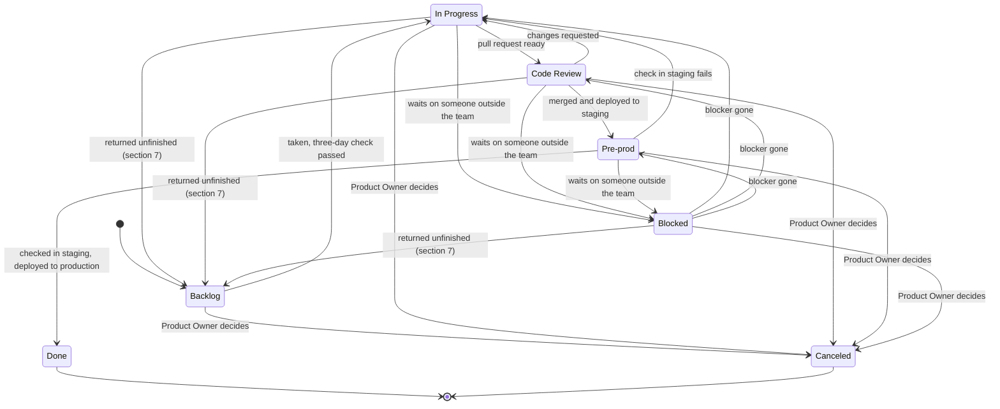

# Workflow

Which status a work item is in, when it moves, when to comment, and what to do when it is blocked,
cancelled or only partly done. Read it when you set up a board, move a work item, or decide what
to do with an item that will not finish. What a work item holds and how big it is are in
[tickets.md](tickets.md); this file covers its life on the board.

**Navigation**

- [1. Statuses, columns and resolutions](#1-statuses-columns-and-resolutions)
- [2. The board](#2-the-board)
- [3. The workflow diagram](#3-the-workflow-diagram)
- [4. Blocked](#4-blocked)
- [5. Canceled](#5-canceled)
- [6. Comments](#6-comments)
- [7. A work item that is partly done](#7-a-work-item-that-is-partly-done)
- [8. Sources](#8-sources)

## 1. Statuses, columns and resolutions

Give every status one written entry condition and one written exit condition. The reason: the
Kanban Guide asks for "explicit policies about how work items can flow through each state from
started to finished", and says policies should be "sparse, simple, well-defined, visible, always
applied, readily changeable". A status with no written condition means something different to each
person who moves an item into it.

Jira sorts the parts like this:

| Part | What it says | Jira rule |
|---|---|---|
| Status | Where the item is now | Every status belongs to one of three categories: To do, In progress, Done |
| Resolution | How the item ended | "A work item resolution is usually set when the status is changed"; the defaults are Done, Won't do and Duplicate |
| Column | A place on the board | A column maps one or more statuses; an unmapped status is hidden; "Jira only considers work items in the right-most column of your board as complete" |

So a status says where the item is, and a resolution says how it ended. The right-most column is
the one that counts: an item in any other column is open, whatever its status is called.

Keep the number of statuses small. Atlassian: "every status and transition adds more complexity
for the team". Jira's own templates are smaller than the board in section 2: a scrum board has To
do, In progress and Done, and a kanban board has Backlog, Selected for development, In progress and
Done. No Jira template has a status for "ready for release" or for staging. Each extra status in
this file is therefore a choice of this practice, and a team that does not need one drops it.

## 2. The board

Use these seven statuses. The set and the conditions are this practice's own: no standard names
them, and the sources in section 1 only say that each status needs a written policy.

| Status | Category | Enters when | Leaves when | Who moves it out |
|---|---|---|---|---|
| Backlog | To do | The work item is created; the Product Owner orders it there | Someone takes it and the three-day check passes | The person who takes it |
| In Progress | In progress | A person has started the work, after the three-day check | The pull request is open and ready for review | The author |
| Blocked | In progress | The item waits on someone outside the team (section 4) | The blocker is gone | The assignee |
| Code Review | In progress | The pull request is open and ready for review | The pull request is merged and deployed to staging, or the reviewer asks for changes | The author |
| Pre-prod | In progress | The change is merged and deployed to the pre-production (staging) environment | It is checked in staging against its acceptance criteria and deployed to production, or the check fails | The person who runs the release |
| Done | Done | It is deployed to production and the Definition of Done is met | Never; a new problem is a new work item | Nobody |
| Canceled | Done | The Product Owner decides the work will not be done (section 5) | Never | Nobody |

Notes on the rows:

- **Backlog to In Progress.** Before an item enters In Progress, apply the three-day check of
  [tickets.md](tickets.md) section 3. The reason: it is cheaper to split an item before the work
  starts than in the middle of it.
- **Code Review.** The reviewer gives a first response within one business day. Google's
  engineering practices: "One business day is the maximum time it should take to respond to a code
  review request". The reason: a review that waits all week holds the whole item, and the author
  starts something else. The pull request rules are in [git.md](../git/git.md) section 4.
- **Pre-prod.** It is the status in which the change, already merged and deployed to the staging
  environment, is checked there before production. It does not mean "ready but not deployed". Staging is an environment that copies production, where work is
  checked before production; Jira's Deployments feature lists staging as one of its four
  environment types (development, testing, staging, production). The reason for the status: the
  item is finished for the developer but not yet for the user, and the board should show that. A
  team with no staging environment drops Pre-prod, because no Jira template has such a status and
  an unused one only adds complexity. A team that drops Pre-prod moves an item from Code Review to
  Done when it is merged and deployed to production.
- **Done.** It means deployed to production with the Definition of Done met. The Definition of Done
  names the production deploy ([tickets.md](tickets.md) section 2 owns that rule and its reason).
  Atlassian's own example of a Definition of Done stops earlier: "Product increment has been
  deployed to a staging environment and tested by the team." So the line moves with the team, and
  this practice puts it at production.
- **One column for Done and Canceled.** Map both statuses to the right-most column. The reason:
  Jira counts only that column as complete, so a Canceled item in its own column would stay open
  in sprint and release reports.
- **Blocked and the work-in-progress limit.** How a Blocked item counts against the limit is in
  section 4.

The seven statuses are for stories, tasks and bugs. This practice's own rule: an epic and a subtask
need only To do, In progress and Done. The epic's owner moves an epic to Done when the "Done when"
of its dictionary entry holds ([wbs.md](wbs.md) section 6), and the Developer who does a subtask's
step moves the subtask.

An open item can go back to Backlog when it is returned unfinished (section 7).

Check: for each status, find its row in this table in your board's written policy. A status with no
entry or exit condition is not ready for use.

## 3. The workflow diagram



The diagram is good because every arrow has a condition from the table in section 2, a Blocked
item goes back to the status it left when the blocker is gone, and the only way to Done is through
production. Jira's workflow editor shows the same workflow as a diagram, so the team can compare
this one with its board and see where the board differs.

## 4. Blocked

Move an item to Blocked when it waits on someone outside the team: another team, a vendor, or a
decision that is not the team's to make. The conditions are this practice's own. They follow the one
case where a Blocked column works, which Bowler states: acceptable "if it's a clear part of the
workflow and we're blocked on a specific known thing". The Kanban Guide has no blocked column and
no blocked policy; it asks only for "Unblocking blocked work" as part of active management, so the
status is a team policy, and this section is that policy.

On the move, do three things:

1. Name the blocker: link the item with "is blocked by" to the work item that holds the blocker, or
   write who or what it is.
2. Add a comment that names the blocker and the date you will check again (section 6).
3. Add Jira's flag, if the board shows flags. A flag is a yellow card, you can add a comment when
   you flag, and `Flagged = Impediment` finds all flagged items.

The reasons: a link or a name lets anyone find the blocker without asking you, and the date makes
the wait end in a check and not in silence.

When the blocker is gone, move the item back to the status it left. The reason: the item keeps its
place in the flow, so Code Review does not turn into In Progress by accident.

A block the team can clear the same day is not Blocked. Flag the item and leave it where it is.
The reason: a move to Blocked for an hour of waiting hides the stage and costs more than the wait.

The cost of the status is real. Steelman argues that a Blocked column breaks work-in-process
limits, hides the stage where the item stopped and gets less attention than a flagged item in its
own column; Bowler adds that it loses the item's position and age. This practice keeps the status
for waits outside the team and accepts that cost, and covers it with two rules: a Blocked item
counts toward the limit of [principles.md](principles.md) section 3, because it is started and not
finished and the limit exists to stop people from starting more while things wait, and age is the
signal to act. Vacanti: "By definition, any
work that is blocked or on-hold is not flowing." At the board look of
[principles.md](principles.md) section 3, ask of each Blocked item who can clear it and when it is
due, and escalate the oldest first.

What the standards call it:

- PMI calls it an impediment: "An obstacle that prevents the team from achieving its objectives.
  Also known as a blocker."
- The Scrum Guide makes the Scrum Master accountable for "Causing the removal of impediments". The
  Guide says this of impediments only; it does not say who moves a work item.
- PRINCE2 raises an issue and an exception report when a tolerance is forecast to be exceeded. This
  is from a secondary source, not the PeopleCert manual.

## 5. Canceled

Use Canceled for work the Product Owner has decided will not be done, and set the resolution
Won't Do, or Duplicate when another item holds the same work. The reason: Jira says how an item
ended through its resolution, and a Canceled item with no resolution stays "unresolved" in filters
and reports. The Canceled status sits in the Done category; set the resolution on the transition
into it, because the category alone does not set one.

Check this in your workflow: the unresolved-item behaviour comes from community threads, not from an
Atlassian page. Open one cancelled item and confirm its Resolution field is filled. If your
workflow cannot set a resolution on that status, use the fallback: one Done status, and the
resolution Won't Do for items that end without being done.

Write a comment when you cancel (section 6): why the item is cancelled, and a link to the duplicate
or to the decision. The reason: months later, the comment is the only record of why the work did not
happen.

The Product Owner decides. This is this practice's own rule, built on Cohn's point that "the product
owner must decide if the work is still valuable". Anyone may propose a cancel; the assignee, or
the Product Owner when no one is assigned, moves the item after the decision.

Never use Canceled to close unfinished work. Unfinished work is split or returned to the backlog
(section 7). The reason: Canceled says "no one needs this", and a half-built feature behind it
shows up later as a surprise.

## 6. Comments

No standard, no Atlassian page and no named practitioner sets what a comment should hold, so
the rules in this section are this practice's own. They follow from how Jira shows an item: the
description is the item's current text, and a comment is a dated entry that others are notified of.

- **The description holds the current truth of the item: what must be true when it is done. A
  comment holds what changed and why.** The reason: a reader who opens the item should not have to
  read a thread to learn what the work is.

Comment when:

- A decision changes the item. Update the description in the same minute, and write the decision in
  a comment, so the history shows what changed and why.
- A question needs one person's answer. Write @ and their name; the mention notifies them, and a
  comment without it may sit unread.
- The item goes into or out of Blocked (section 4).
- The item is cancelled (section 5).
- The item is split (section 7).
- The item is handed to another person. Say where the work stands and what is left.

Do not comment:

- Status the board already shows ("moved to Code Review").
- "+1" or thanks that carry no decision.
- Secrets: passwords, tokens, keys. A comment is visible to everyone who can see the item.
- A whole chat thread. Summarise the decision in the comment and link the thread.

A bug's steps, its expected result and its actual result go in the description, not in comments
([tickets.md](tickets.md) section 2).

Bad: a comment that only repeats status.

```
PROJ-135: working on it
```

The problem is that it says nothing the board does not, and nobody can act on it.

Good: the same moment, with the decision in it.

```
PROJ-135: Translation of the error texts will not fit this sprint. Decision with Jane Doe:
the English texts ship now (criteria 1 and 2), and the translation moves to PROJ-139.
Description updated.
```

The good comment names what changed (the scope of the item), why (the translation will not fit),
who decided, and where the rest went, and the description was updated in the same minute so the
item's text matches the decision.

## 7. A work item that is partly done

Decide as soon as it is clear that the item will not finish in the sprint, and do not wait for the
last day. The reason: Cohn allows a split only when it is early, and says a split on the last day
circumvents the rule that unfinished work earns no credit.

Then take one of three ways. The first question: would the done part meet the Definition of Done on
its own once it goes through Pre-prod to production, and does it have value without the rest?

- **Yes: split.** Use Jira's Split work item in the backlog. Jira links the original to the new
  item, and the new item starts in the first status. Close the done part: it goes through
  Pre-prod to Done like any item. The rest is a new item in the backlog, and the Product Owner
  orders it. Cohn: unfinished work does not move to the next sprint by itself, "the product owner
  must decide if the work is still valuable". Estimate each item for what it now holds; Jira's split
  asks for new estimates.
- **No: return the whole item.** It goes back to the Product Backlog. The Scrum Guide: "If a Product
  Backlog item does not meet the Definition of Done, it cannot be released or even presented at the
  Sprint Review. Instead, it returns to the Product Backlog for future consideration." The Product
  Owner re-orders it, and the team re-estimates the rest.
- **The Product Owner does not want the rest.** Split as above, close the done part, and cancel the
  new item with resolution Won't Do and a comment that says why (section 5).

A team without sprints decides when the item passes the three-working-day limit of
[tickets.md](tickets.md) section 3, not at a sprint's end.

Two limits apply to every way:

- Never rewrite the acceptance criteria to make the item look finished. A criterion that does not
  fit moves with its words unchanged to the new item, or the whole item returns. The reason: the
  criteria are the test of done ([tickets.md](tickets.md) section 2), and changing the test after
  the work is the same as passing it.
- Give no partial credit. Cohn: "Teams earn no partial credit toward their velocity for stories that
  remain unfinished." Count only what meets the Definition of Done. Jira does the same at the end of
  a sprint: unfinished items move to the backlog, to a future sprint or to a new sprint.

Not everyone splits. Zacharias calls a split of an unfinished item "a band-aid", and returns it with
its original points. This practice splits only when the done part stands alone, which is where the
two views meet.

A worked case, from the Acme Corp payments project of [project-example.md](project-example.md).
On day 6 of a 10-day sprint, John Smith sees that `PROJ-135` will not finish. It is a story in Code
Review:

```
PROJ-135  Story    Epic: PROJ-10    Status: Code Review
Show payment errors to the shopper

Acceptance criteria
1. A declined card shows the message "Your card was declined."
2. A provider timeout shows the message "Payment is taking too long. Try again."
3. Both messages are shown in the shop's three languages.
```

Criteria 1 and 2 are done in English and pass review. Criterion 3 needs translations that arrive
next sprint. The English messages have value alone, and they would meet the Definition of Done once
deployed, so the item is split.

```
Split on day 6, in the backlog view (Split work item)

PROJ-135  Story    Status: Code Review -> Pre-prod -> Done after the production deploy
Show payment errors to the shopper (English)
1. A declined card shows the message "Your card was declined."
2. A provider timeout shows the message "Payment is taking too long. Try again."
Comment: Split on day 6. Translation (criterion 3) moves to PROJ-139, unchanged.
         Done part meets the Definition of Done on its own. Jane Doe agreed.

PROJ-139  Story    Epic: PROJ-10    Status: Backlog    (linked to PROJ-135 by the split)
Show payment errors in the shop's three languages
3. Both messages are shown in the shop's three languages.
Comment: Split from PROJ-135. Needs the translations; the Product Owner orders it.
```

The example is good for four reasons. The split came on day 6, when it was clear, not on day 10.
Criterion 3 moved to `PROJ-139` with its words unchanged, so nothing was rewritten to close the item.
`PROJ-135` still goes through Pre-prod and reaches Done only after the production deploy, so Done
keeps its meaning. Each item has a comment that says why and links the other, because Jira's split
does not copy comments.

Check: after a split, open both items. Each one shows the link to the other and a comment that
says why, and criterion 3 appears in exactly one of them.

## 8. Sources

- [Atlassian, "What are work item statuses, priorities and resolutions"](https://support.atlassian.com/jira-cloud-administration/docs/what-are-issue-statuses-priorities-and-resolutions/), undated: status categories, resolutions set at a status change, "Cancelled" and "Rejected" as example statuses.
- [Atlassian, "Configure columns"](https://support.atlassian.com/jira-software-cloud/docs/configure-columns/), 2025-02-16: columns map statuses; the right-most column counts as complete.
- [Atlassian, "What is a simplified Jira workflow"](https://support.atlassian.com/jira-software-cloud/docs/what-is-a-simplified-jira-workflow/), undated: the scrum and kanban defaults.
- [Atlassian, "Best practices for workflows in Jira"](https://support.atlassian.com/jira-software-cloud/docs/best-practices-for-workflows-in-jira/), undated: "every status and transition adds more complexity".
- [Atlassian, "Work with work item workflows"](https://support.atlassian.com/jira-cloud-administration/docs/work-with-issue-workflows/), undated: the workflow editor diagram.
- [Atlassian, "Link GitHub workflows and deployments to Jira work items"](https://support.atlassian.com/jira-cloud-administration/docs/link-github-workflows-and-deployments-to-jira-issues/), undated: the four environment types. No Jira template has a staging status; this is an absence found across the pages above on 2026-10-06.
- [Atlassian, "Establishing staging server environments for Jira applications"](https://confluence.atlassian.com/adminjiraserver071/establishing-staging-server-environments-for-jira-applications-802592273.html), Jira Server documentation, old and undated: the general meaning of a staging environment, read as a definition and not as a Jira Cloud rule.
- [Atlassian, "Flag a work item"](https://support.atlassian.com/jira-software-cloud/docs/flag-an-issue/), undated: flags, the Impediment value, the comment on flagging.
- [Atlassian, "Link work items"](https://support.atlassian.com/jira-software-cloud/docs/link-issues/), undated: "blocks" and "is blocked by".
- Atlassian, ["Watch, share and comment on a work item"](https://support.atlassian.com/jira-software-cloud/docs/watch-share-and-comment-on-an-issue/) and ["Voters, watchers, comment and attachment permissions"](https://support.atlassian.com/jira-cloud-administration/docs/voters-watchers-comment-and-attachment-permissions/), undated, read 2026-10-06, and ["Restrict the comment visibility in a team-managed project"](https://support.atlassian.com/jira/kb/restrict-the-comment-visibility-in-a-team-managed-project/), 2025-09-26: @mentions notify; who may add, edit and delete comments.
- [Atlassian, "Use your scrum backlog"](https://support.atlassian.com/jira-software-cloud/docs/use-your-scrum-backlog/), undated: Split work item and what it copies.
- [Atlassian, "Complete a sprint"](https://support.atlassian.com/jira-software-cloud/docs/complete-a-sprint/), undated: where unfinished items go.
- [Atlassian, "Definition of done"](https://www.atlassian.com/agile/project-management/definition-of-done), undated, read 2026-10-06: the staging example.
- [Atlassian, "Bug report template"](https://www.atlassian.com/software/jira/templates/bug-report), undated, read 2026-10-06: expected against actual in comments.
- Atlassian Community threads ["Canceled remain unresolved"](https://community.atlassian.com/forums/Jira-questions/Canceled-remain-quot-unresolved-quot/qaq-p/1754420), ["Multiple Done statuses vs Resolution"](https://community.atlassian.com/forums/Jira-questions/Multiple-quot-Done-quot-statuses-vs-quot-Resolution-quot-best/qaq-p/3169604) and ["Cancelled issues dragged on from sprint to sprint"](https://community.atlassian.com/t5/Jira-Software-questions/Cancelled-issues-dragged-on-from-sprint-to-sprint/qaq-p/1019310), undated or 2025 and later: a cancelled item stays unresolved without a resolution. Anecdotes, so the check in section 5 is to open one item in your own workflow.
- [Schwaber and Sutherland, The Scrum Guide](https://scrumguides.org/scrum-guide.html), November 2020: Definition of Done, the Increment, impediments, an item that misses the Definition of Done.
- [Kanban Guide](https://kanbanguides.org/english/), version 2025.5, read 2026-10-06: explicit policies, unblocking blocked work.
- [Kanban University, Kanban Guide](https://kanban.university/kanban-guide/), 2021: policies "sparse, simple, well-defined, visible, always applied, readily changeable".
- [PMI Lexicon of Project Management Terms, version 5.0](https://www.pmi.org/-/media/pmi/documents/registered/pdf/pmbok-standards/pmi-lexicon-pm-terms.pdf), January 2026: impediment, also known as a blocker.
- [Google, "Speed of code reviews"](https://google.github.io/eng-practices/review/reviewer/speed.html), eng-practices, undated: one business day.
- [Steelman, "What's wrong with having a Blocked column"](https://prokanban.org/blog/whats-wrong-with-having-a-blocked-column), ProKanban, 2025-04-09.
- [Bowler, "Blocked column"](https://blog.mikebowler.ca/2023/03/31/blocked-column/), 2023-03-31.
- [Vacanti, "The Kanban Pocket Guide, chapter 3"](https://prokanban.org/blog/the-kanban-pocket-guide-chapter-3-actively-managing-items-in-a-workflow), ProKanban, 2024-07-17.
- [PRINCE2 issues](https://prince2.wiki/practices/issues/), undated: a secondary source of unknown edition, not the paid PeopleCert text.
- [Tatham, "How to Report Bugs Effectively"](https://www.chiark.greenend.org.uk/~sgtatham/bugs.html), 1999.
- [Cohn, "Should you re-estimate unfinished stories"](https://www.mountaingoatsoftware.com/blog/should-you-re-estimate-unfinished-stories), 2024-07-15; [Cohn, "Don't take partial credit for semi-finished stories"](https://www.mountaingoatsoftware.com/agile/dont-take-partial-credit-for-semi-finished-stories), 2024-01-16; [Cohn, "Handling work left at the end of a sprint"](https://www.mountaingoatsoftware.com/agile/handling-work-left-at-the-end-of-a-sprint), 2019-09-06.
- [Iqbal, "What happens to Product Backlog items you can't complete"](https://www.rebelscrum.site/post/what-happens-to-product-backlog-items-that-you-can-t-complete-by-the-end-of-the-sprint), 2021-08-01, updated 2024-04-28.
- [Zacharias, "Why splitting unfinished Product Backlog items is a bad idea"](https://www.scrumexpert.com/knowledge/why-splitting-unfinished-product-backlog-items-is-a-bad-idea/), 2017-05-16.
