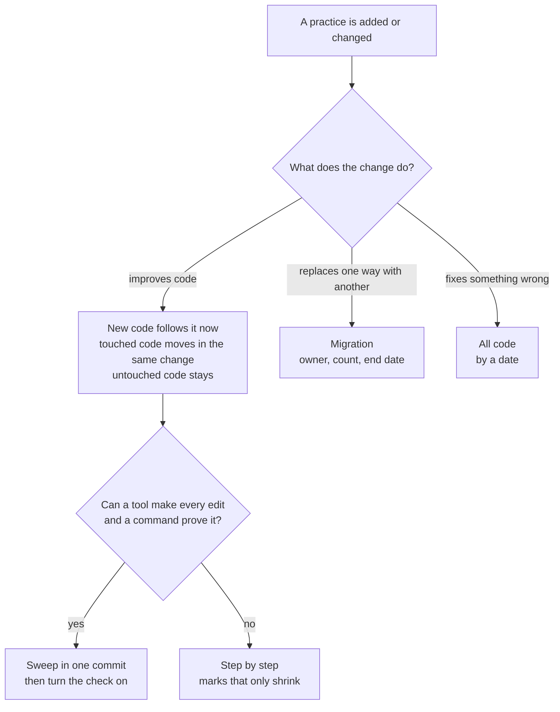

# Refactoring practices

How old code reaches a practice without a rewrite of the repository each time a rule changes, and
without being left half old and half new: new code follows the practice, old code moves when a
change touches it, and a practice that replaces one way with another becomes a migration with an
end.

**Navigation**

- [What is here](#what-is-here)
- [How to adopt](#how-to-adopt)
- [The point to adapt](#the-point-to-adapt)

## What is here

- [refactoring.md](refactoring.md) — the rules, one per section: new, touched and untouched code;
  how to change old code safely; sweep or step by step; migrations; correctness rules; what to do
  when a practice changes; follow-ups; rules for agents; Python; the sources. Read it before a
  change edits code that already exists (a feature, a fix, a move to a practice, a restructure),
  or turns on a new rule.
- [adoption-example.md](adoption-example.md) — one repository and four practice changes, each
  reaching old code its own way: a formatter swept in one commit, a typing rule moved step by
  step, an HTTP client replaced by a migration, and a file that mixes a constant, a query, a route
  and its handler, split into modules when a change touches it. Read it when you plan how a
  practice change reaches old code.

## How to adopt

1. Copy this folder into your repository at `docs/engineering/any-language/refactoring/`.
2. Add one line to your `CLAUDE.md` or `AGENTS.md`: "Before a change edits code that already
   exists (a feature, a fix, a move to a practice, a restructure), or turns on a new rule, read
   `docs/engineering/any-language/refactoring/refactoring.md`." Without it an agent never opens the file.
3. Decide where follow-ups and migrations are tracked, an issue tracker or a file in the
   repository, so that section 8 has a place to point at.
4. Re-check the lines that name a moving target: the tool flags in sections 4 and 10 (`ruff`,
   mypy's `warn_unused_ignores`), and the platforms that read `.git-blame-ignore-revs`.

## The point to adapt

Where the line between "sweep" and "step by step" sits is yours to decide. A codebase with fast,
thorough tests and a strict type checker proves more edits by command, and so can sweep more. A
codebase without them should sweep only formatting. What does not change is the order: pin
behavior with tests, change the structure, then change the behavior, each in its own commit.
