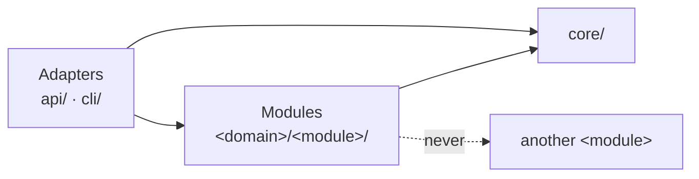

# File structure practices

Where code lives in an application: three kinds of folder and the one import direction they encode,
one shape for every feature folder, file names that say what the file holds, and a few fixed moves
by which the tree grows. How the code inside a file works is out of scope.

- [What is here](#what-is-here)
- [How to adopt](#how-to-adopt)
- [The point to adapt](#the-point-to-adapt)

## What is here

- [file-structure.md](file-structure.md) — the rules, one topic per section: the three kinds of
  folder and the import direction, the role files of a module, `core/`, adapters, the six moves by
  which the tree grows, names and imports, tests, the repository root, the package map, the tool
  that checks the direction, where the practice stops holding, the sources. Read it before you
  create a file, a folder or a module, or move code between folders.
- [layout-example.md](layout-example.md) — the whole tree of a service with an HTTP API and a
  command-line tool, written with placeholders; how a tree like it grows, move by move; the
  import-linter contracts. Read it when you lay out a new repository or add a module.
- [package-map-example.md](package-map-example.md) — the "Package map" section of
  `docs/ARCHITECTURE.md` for that tree: kinds and rules, no module named. Read it when you write or
  change a repository's map.

## How to adopt

1. Copy this folder into your repository at `docs/engineering/file-structure/`.
2. Add one line to your `CLAUDE.md` or `AGENTS.md`: "Before you create a file, a folder or a
   module, or move code between folders, read `docs/engineering/file-structure/file-structure.md`."
   Without it an agent never opens the file.
3. Write your own package map into `docs/ARCHITECTURE.md`, starting from
   `package-map-example.md`, with your package and domain names and your adapters.
4. Add the import-linter contracts and ruff's `TID252` rule to `pyproject.toml`, and run both in CI.
   Old code that breaks a contract reaches the practice the way
   [refactoring.md](../refactoring/refactoring.md) section 4 says: marks that only shrink, not a
   rewrite.

## The point to adapt

The role files are yours to extend. A service with no database never has `models.py` or
`repository.py`; one that calls no language model never has `prompts.py`; a service with a message
queue adds an adapter folder for its consumer. Add a role when a kind of file recurs in several
modules, and give it a row in your map.

What does not change is the shape: adapters, then modules, then `core/`, imports that point that
way only; imports that are always absolute; one file per role, named for what it holds; a file that
stops telling what is inside becomes a folder of the same name.

Outside Python, keep that shape and absolute imports, and take the language's own file names and
its own check for imports ([file-structure.md](file-structure.md) section 12).
