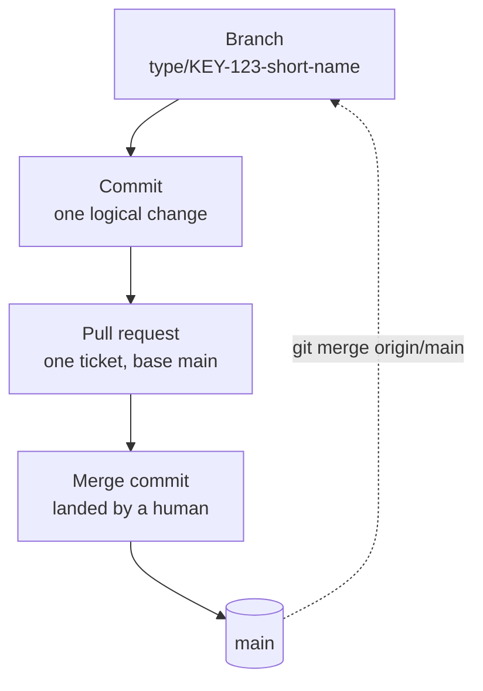

# Git practices

One git model for a repository that people and AI agents both change: ticket-bound branches,
merge commits, and no rewriting of history that has been pushed.

**Navigation**

- [What is here](#what-is-here)
- [How to adopt](#how-to-adopt)
- [The point to adapt](#the-point-to-adapt)

## What is here

- [git.md](git.md) — the rules: branches, commits, pull requests, merging, force push,
  conflicts, several agents, the project README and the navigation block that opens a README
  or a long rules file. Read it before any git operation.
- [commit-example.md](commit-example.md) — three good commit messages and two bad ones, each
  with the reason. Read it when you write a commit message.
- [pr-example.md](pr-example.md) — one complete pull request description, every section
  filled in. Read it when you open a pull request.
- [readme-example.md](readme-example.md) — an ideal project README, section by section. Read
  it when you start a project README or rewrite one.

## How to adopt

1. Copy this folder into your repository at `docs/engineering/git/`.
2. Add one line to your `CLAUDE.md` or `AGENTS.md`: "Before any git operation, read
   `docs/engineering/git/git.md`." Without it an agent never opens the file.
3. Set the repository up the way `git.md` section 5 names under "Repository configuration".
4. Each developer runs `git config --global merge.conflictStyle zdiff3` once. Nothing in a
   repository can turn this on for the people working in it, and section 7 says what it buys.
5. Re-check two lines that name a moving target: the git version in section 1, and the link in
   section 9 to the doc about agent files, which lives outside this folder. Copy that doc too,
   or drop the sentence.

A fuller step-by-step skill for commits and pull requests is planned in the `skills` folder of
this library. An adopting repository does not need it: the rules in `git.md` stand on their
own.

## The point to adapt

Merge-only landing is the decision to make for yourself. The rest of `git.md` works the same
under any landing method.

To change it, edit `git.md` section 5 and the merge-method setting it names, not the examples.
If you switch to squash merging, delete the branch after every merge and never reuse it, or
the same conflicts come back the next time it is merged. The "every commit keeps its SHA"
argument in that section stops holding as well.
