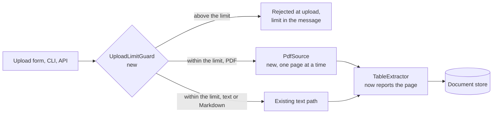

# Pull request example

One complete pull request for the branch `feat/PROJ-520-native-pdf-input`, written to the
template in [git.md](git.md) section 4. It carries the same change as the first message in
[commit-example.md](commit-example.md), so branch, commit, and pull request tell one story.

## Title

```
feat [PROJ-520]: accept native PDF input for document ingestion
```

Without a ticket the same title is `feat(ingest): accept native PDF input`.

## Description

Everything between the two rules is the pull request body, as pasted into GitHub. The
headings are the body's own.

---

## Summary

`docparse` now takes a **PDF as input** everywhere a user meets ingestion: the upload form,
the CLI, and the API. Until now a user converted the PDF to text first, which lost the page
structure and made **scanned documents** unusable. The conversion step is gone, every
extracted table carries the **page it came from**, and a file above the upload limit is
**rejected at upload** instead of failing minutes later in the pipeline. One configuration
key is renamed (see ⚠️ Breaking Changes).



## Jira Ticket

[PROJ-520](https://tracker.example.com/browse/PROJ-520)

## What's Changed

- **PDF as an input format.** `PdfSource` reads the file and hands each page to the
  existing text pipeline as a page-aware document, in reading order. The upload form, the
  `docparse ingest` command, and `POST /documents` accept `application/pdf` and route to it;
  text and Markdown input keep their current path. A scanned PDF with no text layer ingests as
  pages with empty bodies, so page counts stay right (OCR is out of scope, see Notes).
- **Tables report the page they came from.** The page-aware document carries page breaks
  through extraction, so `TableExtractor` writes a `page` number on every table it finds.
  Before, a table from a converted text file had no page, and a reader had to search the
  original. The number is the page a viewer shows, starting at 1.
- **Upload limit enforced at upload.** `UploadLimitGuard` checks the file size before anything
  is written and rejects a file above `ingest.max_upload_mb` with the limit named in the
  message. Before, an oversized file failed several minutes later, after the pipeline had
  written partial output that then had to be cleaned up.

## Verification

*Checked in this session*

- `make check` (lint, types, fast tests): passed, 212 tests, 14 of them new in `tests/ingest/`.
- `make test-integration` against a local Postgres: passed, 31 tests.
- A 12-page text PDF through the upload form: 12 pages ingested, numbered 1 to 12; the tables
  on pages 4 and 9 extracted with the right `page` number.
- A scanned PDF with no text layer: 9 pages ingested with empty bodies, page count 9, no error.
- Negative check: a 60 MB file against a 50 MB limit is rejected at upload with "50 MB" in the
  message, and nothing is written to storage.

*For the reviewer*

- The limit is read from `ingest.max_upload_mb`. Expected: staging shows 50 MB, the number
  support tells customers; production shows 200 MB.
- Upload a `.docx`. Expected: rejected as an unsupported type, and nothing is written.
- The upload form was checked in one browser. Expected in a second browser: the same 12-page
  PDF uploads and reports 12 pages.
- Not run: the load suite (`make test-load`). Expected: a 300-page PDF ingests within the
  30-second budget.

## ⚠️ Breaking Changes

- **Configuration key renamed: `ingest.max_text_mb` → `ingest.max_upload_mb`.** What breaks:
  a deployment that sets the old key. The old key is ignored, so the limit falls back to the
  default of 20 MB instead of failing at startup; the startup log warns once while the old key
  is present. Blast radius: every environment with a custom limit; staging (50 MB) and
  production (200 MB) both set one today. Migration: rename the key before you deploy; the
  value carries over unchanged.

## Notes

- OCR for scanned PDFs is a separate ticket (PROJ-531). Keeping the page structure now means
  citations will not shift when OCR lands.
- Dependency added: `pypdf 6.1.0`, a pure-Python PDF reader, used only by `PdfSource`. No
  system package needed.

> ⚠️ **Contract change:** the `POST /documents` response and the CSV export gain a `page`
> field on every table. Additive: an existing client ignores it, and nothing is renamed.

## Risks

- Reading order comes from the PDF's own text layer. A two-column layout with a broken text
  layer can interleave the columns; tests cover single-column and simple two-column files only.
- `PdfSource` loads one page at a time, but `TableExtractor` holds all tables of a document in
  memory until the end. A 300-page document with a table on every page is not measured yet
  (the load suite above).

---

[git.md](git.md) section 4 says which sections may be left out, and why Verification never
is. Most changes break nothing, so most pull requests carry no ⚠️ Breaking Changes section.

The diagram is here because the change reroutes a flow through four components, and a
reviewer would otherwise rebuild that flow from the diff. A one-file fix gets no diagram, and a
pull request never gets more than one.
