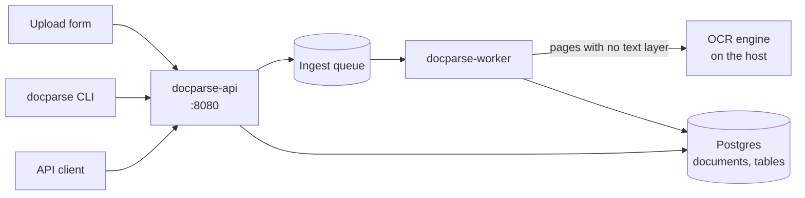

# README example

An ideal `README.md` for `docparse`, the same fictional service the commit and pull request
examples use. It describes the project as it stands today, some releases after the change in
[pr-example.md](pr-example.md). The sections and their order come from [git.md](git.md)
section 9. Everything between the two rules is the example, as it renders in the repository
root.

---

# docparse

Self-hosted document ingestion: PDFs, Word files and scans in, page-aware text and tables out.


## What it does

`docparse` reads a document and returns its text, its tables and its page structure as JSON.
Native PDFs, `.docx` files and scans through OCR all enter the same way: the upload form, the
`docparse ingest` command, or `POST /documents`. Page numbers survive the whole way, so an
extracted table can be traced back to the page a reader sees.

It does not summarize, classify, or answer questions about a document. That is the job of
whatever reads the JSON.

## Why it is useful

Most extraction tools return one long block of text, and the page a number came from is gone.
That is fine for search and useless for anything a person has to check: an invoice total, a
figure in a report, a clause in a contract. `docparse` keeps the structure, so the answer and
its page travel together.

It runs on your own machines. Documents never leave them, which is what makes it usable for
material that cannot go to a hosted service.

## Getting started

Prerequisites: Python 3.11 or newer for the command line, Docker 24 or newer for the service.

Try it on one file:

```bash
pip install docparse
docparse ingest invoice.pdf --out invoice.json
```

```
invoice.pdf: 3 pages, 2 tables, 0 pages without a text layer
wrote invoice.json (14 KB)
```

Run the service:

```bash
git clone https://github.com/acme-corp/docparse.git
cd docparse
cp deploy/.env.example .env   # the defaults work for a local run
make up                       # API on http://localhost:8080, plus the worker and Postgres
curl -F file=@invoice.pdf http://localhost:8080/documents
```

Scans need an OCR engine on the host. `docs/ocr.md` has the setup for each platform.

### Configuration

Every key is read from the environment, or from `docparse.toml` when that file exists.

| Key | Default | What it changes |
| --- | --- | --- |
| `ingest.max_upload_mb` | `50` | Rejects an upload above this size, before anything is written. |
| `ingest.ocr_engine` | `tesseract` | Engine used for pages with no text layer. `none` skips them. |
| `store.dsn` | `postgresql://localhost/docparse` | Where documents and tables are stored. |

## How the parts fit together



The API accepts and validates, the worker does the reading. They are separate processes, so a
300-page scan does not block an upload. Postgres holds all the state: stop everything, keep the
volume, and nothing is lost.

## Project structure

```
docparse/
├── src/docparse/
│   ├── api/          # HTTP routes and request schemas, no extraction logic
│   ├── ingest/       # input formats, the upload size guard, the page-aware document
│   ├── extract/      # text pipeline and the table extractor
│   ├── store/        # Postgres models and migrations
│   └── cli.py        # the `docparse` command
├── deploy/           # Dockerfile, compose file, .env.example
├── docs/             # JSON format reference, OCR setup, operations runbook
├── tests/
│   └── fixtures/     # one sample document per input format
├── Makefile          # up, check, test-integration, test-load
└── pyproject.toml
```

Generated with `tree -L 2 --dirsfirst`, then cut to what a newcomer opens. Run `tree src/` for
the rest.

## Where to get help

- Usage questions: the Discussions tab of the repository.
- Bugs and feature requests: open an issue at https://github.com/acme-corp/docparse/issues.
  Include the input format, the command you ran, and the version from `docparse --version`.
- Security reports: security@example.com, not a public issue.

## Maintainers and contributing

Maintained by the document platform team at Acme Corp. Jane Doe (`@jane-doe`) reviews and
lands changes.

Pull requests are welcome. Read `CONTRIBUTING.md` first: it has the branch and commit
conventions, and `make check` has to pass before review.

## License

MIT, © 2026 Acme Corp. See the `LICENSE` file in the repository root.

---

The example ends here. Three choices in it are worth naming.

The diagram is a deployment view. It answers what a reader has to run and what talks to what,
which is the question standing between a clone and a working service. The diagram in
[pr-example.md](pr-example.md) answers a different one, what a single change reroutes, so
neither replaces the other. A library with one entry point and no services gets neither.

The structure tree stops at the folder level. A file appears only when the file itself is what
a reader opens (`cli.py`). Listing every module would make the section wrong at the next
rename, and `tree` prints that better anyway.

There is no table of contents. GitHub and GitLab build an outline from the headings, and a
hand-written one is one more list to keep in sync. In a real repository the links to
`CONTRIBUTING.md`, `LICENSE` and `docs/ocr.md` are relative links, not code spans: a relative
link keeps working on every branch and every fork.

Every name is a placeholder. `docparse`, Acme Corp and Jane Doe do not exist.
