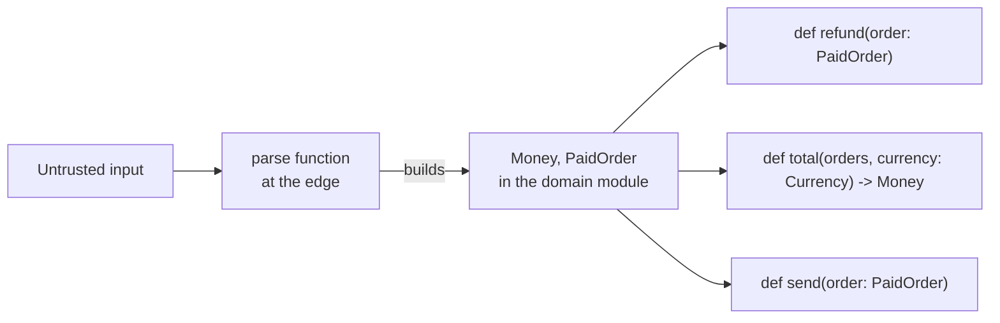

# Python practices

How to write Python that writes each rule in the type or signature a caller already reads, so
no call site has to remember it.

## What is here

- [python.md](python.md) — the principles, one per section: when each fires, what you do, and
  how anyone tells. Read it before you add a module, a type, or a check.
- [explicit-constraints-example.md](explicit-constraints-example.md) — the same six modules
  passing a bare `dict` around, then passing a `PaidOrder` — every signature past the webhook
  names the type. Read it when you apply section 2.

More principles land as sections of `python.md`, each with its own example file when the
principle needs one.

## How to adopt

1. Copy this folder into your repository at `docs/engineering/python/`.
2. Add one line to your `CLAUDE.md` or `AGENTS.md`: "Before you add a Python module, a type, or
   a check, read `docs/engineering/python/python.md`." Without it an agent never opens the file.
3. Put a type checker in CI and make the build fail on it. Section 2's table is half wishful
   thinking in a repository where nothing runs one: `Literal` and `NewType` are enforced by the
   checker and by nothing else.
4. Re-check the two lines that name a moving target: the minimum Python version in section 1,
   and the pydantic spellings in section 2's table.

## The point to adapt

Which mechanism you reach for first is yours to decide. This folder shows the standard library
— `enum`, `dataclasses` — because every repository already has it and nothing needs installing.
A repository that already depends on pydantic should use it instead: it checks the field values
at runtime. attrs checks a field only where you declare a validator, and msgspec checks when it
decodes, not when you construct — on those routes, as on the standard library route, every value
check is one you state yourself, not one the annotation gives you.

What does not change is the shape: untrusted data becomes a typed value at the edge, and every
function past it names that type in its signature; no second place re-checks it, except the
point-of-use assertion condition 3 of the section keeps.
