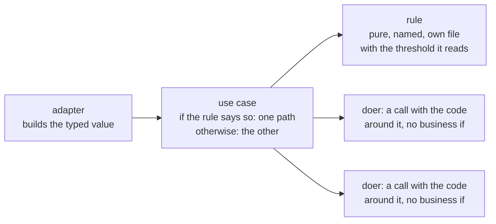

# Python practices

How to write Python in which the reader sees, at the line in front of them, what a value is and
which path runs: the business decision is an `if` in the use case, the rule it asks is a named
function, and the types hold no logic. Which file holds each one is
[file-structure.md](../file-structure/file-structure.md) section 3.

**Navigation**

- [What is here](#what-is-here)
- [How to adopt](#how-to-adopt)
- [The point to adapt](#the-point-to-adapt)

An arrow reads "uses".

## What is here

- [python.md](python.md) — the principles, one per section: when each fires, what you do, and
  how anyone tells. Section 2 is where a decision and a constraint live; section 3 is strict
  types, including closed sets of values that are never a bare `str`. Read it before you add a
  module, a type, or a check.
- [explicit-constraints-example.md](explicit-constraints-example.md) — a checkout whose one
  business rule hides inside a doer, then the same checkout with the `if` in the use case and the
  rule in its own file. Read it when you apply section 2.

More principles land as sections of `python.md`, each with its own example file when the
principle needs one.

## How to adopt

1. Copy this folder into your repository at `docs/engineering/python/`.
2. Add one line to your `CLAUDE.md` or `AGENTS.md`: "Before you add a Python module, a type, or
   a check, read `docs/engineering/python/python.md`." Without it an agent never opens the file.
3. Set up the type checker the way [static-checks.md](../static-checks/static-checks.md) says.
   Section 2's table is half wishful thinking in a repository where nothing runs one: `Literal`,
   `NewType` and the exhaustiveness of a `match` are enforced by the checker and by nothing else
   before the code runs. In a repository that already has code, the checker reaches old code the
   way [refactoring.md](../refactoring/refactoring.md) section 10 says, not by a rewrite.
4. Re-check the lines that name a moving target: the minimum Python version in section 1, the
   pydantic spellings in section 2's table, the mypy and pyright flags named under it, and the
   library versions and `typing_extensions` backports named in section 3.

## The point to adapt

Which mechanism you reach for first is yours to decide. This folder shows the standard library
— `enum`, `dataclasses`, `typing.assert_never` — because every repository already has it and
nothing needs installing. A repository that already depends on pydantic should use it instead:
it checks the field values at runtime. attrs checks a field only where you declare a validator,
and msgspec checks when it decodes, not when you construct — on those routes, as on the standard
library route, every value check is one you state yourself, not one the annotation gives you.

The mechanism is yours; the shape is not. Which function holds the decision and which holds the
rule is section 2 of `python.md`; which file each one lives in is
[file-structure.md](../file-structure/file-structure.md) section 3. The check in `python.md` is the
same whichever library builds the types.
