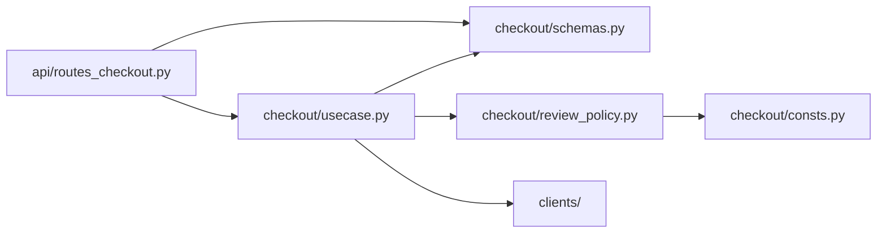

# Example: the business `if` where the reader can see it

A worked before-and-after for [python.md](python.md) section 2. A shop takes an order and charges
the card. One business rule changes the flow: a customer's first order above 1,000 is not charged
at once, because the risk team checks it by hand first. Names are invented. The three clients
(card payments, the review queue, email) stand for outside systems, and their bodies are not
shown: each one is a single call to that system, and `charge` returns the payment's id.

Both versions share the order type and the threshold below, and the same rule. What moves is the
decision: from inside a doer to the first line of the use case.

Two files start the same in both versions.

`checkout/schemas.py`

```python
from dataclasses import dataclass
from decimal import Decimal


@dataclass(frozen=True)
class Order:
    order_id: str
    email: str
    card_token: str
    total: Decimal
    previous_orders: int
```

`checkout/consts.py`

```python
from decimal import Decimal

# Card fraud clusters in a new customer's first large order, so the risk
# team checks those by hand before any money moves.
MANUAL_REVIEW_THRESHOLD = Decimal("1000")
```

## Before: the decision hides inside a doer

`checkout/usecase.py`

```python
from checkout.confirmation import send_confirmation
from checkout.payment import charge_card
from checkout.schemas import Order


def place_order(order: Order) -> None:
    payment_id = charge_card(order)

    send_confirmation(order, payment_id)
```

`checkout/payment.py`

```python
from checkout.consts import MANUAL_REVIEW_THRESHOLD
from checkout.schemas import Order
from clients.payments import gateway
from clients.review_queue import review_queue


def charge_card(order: Order) -> str | None:
    if order.previous_orders == 0 and order.total > MANUAL_REVIEW_THRESHOLD:
        review_queue.submit(order.order_id)

        return None

    return gateway.charge(order.card_token, order.total)
```

`checkout/confirmation.py`

```python
from checkout.schemas import Order
from clients.mailer import mailer


def send_confirmation(order: Order, payment_id: str | None) -> None:
    if payment_id is None:
        return

    mailer.send_order_confirmation(order.email, order.order_id, payment_id)
```

### What the reader of `place_order` cannot see

One fault, seen from three sides: the decision, and what came of it, happen out of sight of the
function that runs the flow.

1. **There are two paths, and the use case shows one.** `place_order` reads as "charge, then
   confirm". The rule that sends a first large order to review sits inside `charge_card`, a
   function whose name promises a charge. To learn that a charge may not happen, the reader has
   to open it. The review-queue import is the trace: nothing in the signature says a charge needs
   a review queue, and a test has to patch that module to run the function.
2. **`None` carries the decision.** `charge_card` returns `None` to mean "sent to review", and
   `send_confirmation` returns without a word when it gets one. `str | None` says a payment id may
   be missing; it does not say why, and the reader has to find the `return None` inside
   `charge_card` to learn it.
3. **The result says nothing.** `place_order` returns `None` on both paths, and `Order` holds no
   status, so the route that calls it cannot tell a confirmed order from one waiting for review,
   and cannot tell the customer which one happened.

Every piece works: the rule is right, the threshold has a name and a reason, and the code runs.
Run on CPython 3.13 with recording stand-ins for the clients, a first order of 1,500 makes
`place_order` return `None`, puts the order in the review queue, charges nothing and mails
nothing, and the route gets the same `None` it gets for a confirmed order. The fault is where
things are: the flow is decided in a place the reader of the flow never looks.

## After: the use case asks the rule, then acts

```text
checkout/
├── schemas.py          what an order is, and how a checkout can end: types only
├── consts.py           the review threshold
├── review_policy.py    the rule: does this order need a manual review?
└── usecase.py          place_order: the business if, then the steps
api/routes_checkout.py  the adapter: builds the Order, calls place_order, answers HTTP
clients/                payments, the review queue, mail: one call each to an outside system
```

`payment.py` and `confirmation.py` are gone: without the `if`, each would be one line around one
client call, and the use case calls the clients directly.

An arrow reads "imports". The rule and the types import no client, and nothing under `checkout/`
imports the adapter.



`checkout/usecase.py`

```python
from checkout.review_policy import needs_manual_review
from checkout.schemas import CheckoutResult, Order
from clients.mailer import Mailer
from clients.payments import PaymentGateway
from clients.review_queue import ReviewQueue


def place_order(
    order: Order,
    payments: PaymentGateway,
    review_queue: ReviewQueue,
    mailer: Mailer,
) -> CheckoutResult:
    if needs_manual_review(order.total, order.previous_orders):
        review_queue.submit(order.order_id)

        return CheckoutResult.IN_REVIEW

    payment_id = payments.charge(order.card_token, order.total)

    mailer.send_order_confirmation(order.email, order.order_id, payment_id)

    return CheckoutResult.CONFIRMED
```

`checkout/review_policy.py`

```python
from decimal import Decimal

from checkout.consts import MANUAL_REVIEW_THRESHOLD


def needs_manual_review(total: Decimal, previous_orders: int) -> bool:
    is_first_order = previous_orders == 0

    return is_first_order and total > MANUAL_REVIEW_THRESHOLD
```

`checkout/schemas.py` gains the result type, below `Order`:

```python
from enum import StrEnum, unique


@unique
class CheckoutResult(StrEnum):
    CONFIRMED = "confirmed"
    IN_REVIEW = "in_review"
```

`api/routes_checkout.py`, the part that turns the result into a response. The rest of the route
parses the request body into an `Order`, rejecting a field of the wrong type, passes `place_order`
the three clients created once at startup, and answers with `status_for(result)` and
`result.value` in the response body.

```python
from http import HTTPStatus
from typing import assert_never

from checkout.schemas import CheckoutResult


def status_for(result: CheckoutResult) -> HTTPStatus:
    match result:
        case CheckoutResult.CONFIRMED:
            return HTTPStatus.CREATED
        case CheckoutResult.IN_REVIEW:
            return HTTPStatus.ACCEPTED
        case _ as unreachable:
            assert_never(unreachable)
```

### What changed

Each thing the reader of `place_order` could not see in Before is now written where that reader
looks.

- **The decision is the first line of the use case.** `place_order` reads the way the business
  says it: if the order needs a manual review, send it to review and stop; otherwise charge the
  card and confirm. Both paths are on the screen, and no call below hides a third.
- **The rule has a name.** `charge_card` both decided and acted; the After separates the question,
  `needs_manual_review`, from the actions. The rule answers from two plain values, and a test
  calls it with no setup.
- **Each doer does one thing, every time.** `submit`, `charge` and `send_order_confirmation`
  receive plain values and nothing about the review: no `None` to check and no path to skip.
- **The result says which path ran.** `place_order` returns a `CheckoutResult`, and the adapter
  turns it into `201` or `202`. The `match` has one arm per member plus the `assert_never` arm,
  so a third result fails the type checker at that line, and fails at runtime with
  `AssertionError` if no checker ran.
- **The dependencies are in the signature.** The use case receives the three client objects as
  parameters. It imports only their classes, for the annotations, and creates none. A reader sees
  everything it touches in one place, and a test passes stand-ins without patching a module.

Run on the same CPython 3.13 with the same stand-ins: a first order of 1,500 returns `IN_REVIEW`
and reaches only the review queue; a first order of 500 and a returning customer's order of 1,500
return `CONFIRMED`, are charged and are mailed; an order of exactly 1,000 is not reviewed, since
the rule says "above"; `status_for` maps both members, and a value outside the set raises
`AssertionError`.

### What this example does not claim

- **Every charge goes through the use case.** Once the `if` leaves `charge_card`, a caller that
  charges a card without `place_order` skips the review.
- **The After has a cost.** `place_order` takes the three clients in its signature, so whoever
  calls it has to hold them.
- **What is left out.** The order is not saved, and a declined card is not handled: `charge`
  raises, and the error reaches the adapter. A real service would also read the count of
  previous orders from the customer's history before the `if`, instead of receiving it on the
  order. Each is one more step in the use case, not a new branch inside a doer.

Why two paths stay a plain `if` instead of a class per outcome, and which of these lines CPython
enforces and which only a type checker does, is in [python.md](python.md) section 2.
