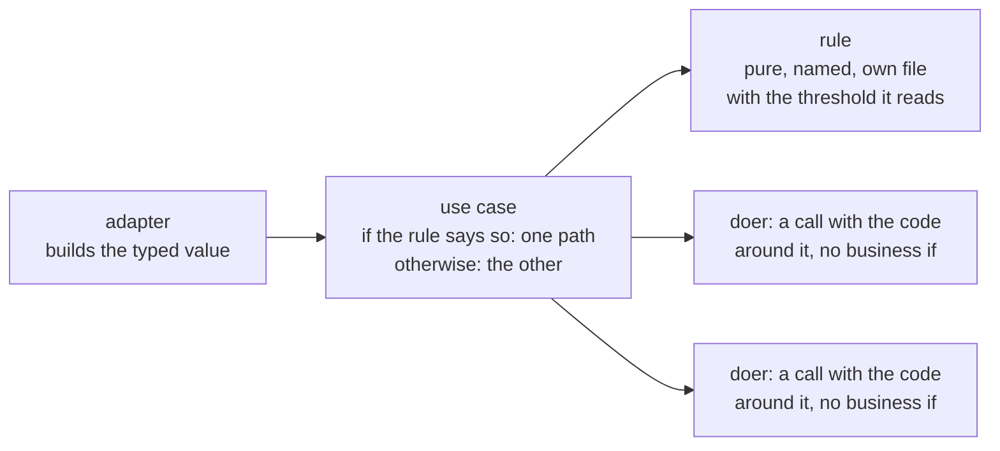

# Python practices

How to write Python in which the reader sees, at the line in front of them, what a value is and
which path runs: the business decision is an `if` in the use case, the rule it asks is a named
function, and the types hold no logic. Which file holds each one is
[file-structure.md](../../any-language/file-structure/file-structure.md) section 3.

**Navigation**

- [What is here](#what-is-here)
- [How to adopt](#how-to-adopt)
- [The point to adapt](#the-point-to-adapt)

An arrow reads "uses".

## What is here

- [python.md](python.md) — the principles, one per section: when each fires, what you do, and
  how anyone tells. Section 2 is where a decision and a constraint live; section 3 is strict
  types, including closed sets of values that are never a bare `str`; section 4 is Pydantic at the
  edge; section 5 is the application's settings. Read it before you add a module, a type, or a
  check.
- [explicit-constraints-example.md](explicit-constraints-example.md) — a checkout whose one
  business rule hides inside a doer, then the same checkout with the `if` in the use case and the
  rule in its own file. Read it when you apply section 2.
- [settings-example.md](settings-example.md) — clients that each read the environment with their
  own defaults, then one settings class built at startup, the clients that take its values, and
  the tests of what the class itself decides. Read it when you add or change the application's
  settings.

More principles land as sections of `python.md`, each with its own example file when the
principle needs one.

## How to adopt

1. Copy this folder into your repository at `docs/engineering/python/language/`.
2. Add one line to your `CLAUDE.md` or `AGENTS.md`: "Before you add a Python module, a type, or
   a check, read `docs/engineering/python/language/python.md`." Without it an agent never opens the file.
3. Set up the type checker the way [static-checks.md](../static-checks/static-checks.md) says.
   Section 2's table is half wishful thinking in a repository where nothing runs one: `Literal`,
   `NewType` and the exhaustiveness of a `match` are enforced by the checker and by nothing else
   before the code runs. In a repository that already has code, the checker reaches old code the
   way [refactoring.md](../../any-language/refactoring/refactoring.md) section 10 says, not by a rewrite.
4. Re-check the lines that name a moving target: the minimum Python version in section 1, the
   pydantic spellings in section 2's table, the mypy and pyright flags named under it, the
   library versions and `typing_extensions` backports named in section 3, and the pydantic and
   pydantic-settings behaviour in sections 4 and 5, checked on the versions section 1 names.

## The point to adapt

Data from outside the process becomes a Pydantic model at the edge, and a value the code builds
itself is a standard-library type — `enum`, `dataclasses`, `typing.assert_never` — which is what
the checkout example shows (`python.md` section 4). A repository that parses outside data and does
not have Pydantic adds it. attrs or msgspec stay for a library or tool that must not add a
dependency, and a hot decode path measures first (section 4): attrs checks a field only where you
declare a validator, and
msgspec checks when it decodes, not when you construct, so every value check there is one you state
yourself. The settings have no such choice: every application reads them through
pydantic-settings, added where the repository lacks it; section 5 names where it stops holding:
layered per-environment files, and a tool that must run on the standard library alone.

Whatever builds the types, the shape is fixed. Which function holds the decision and which holds the
rule is section 2 of `python.md`; which file each one lives in is
[file-structure.md](../../any-language/file-structure/file-structure.md) section 3. The check in `python.md` is the
same whichever library builds the types.
