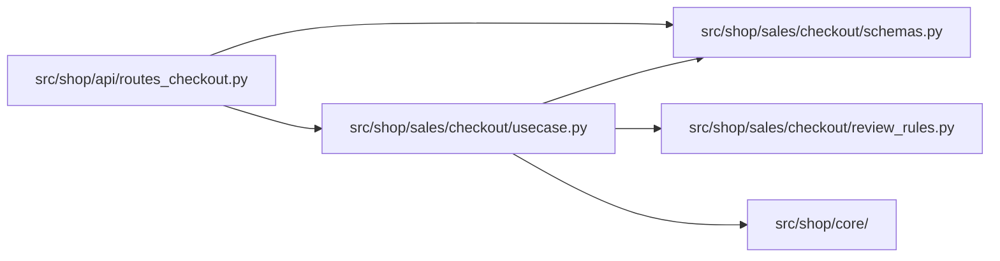

# Example: the business `if` where the reader can see it

A worked before-and-after for [python.md](python.md) section 2. A shop takes an order and charges
the card. One business rule changes the flow: a customer's first order above 1,000 is not charged
at once, because the risk team checks it by hand first. Names are invented. The three clients
(card payments, the review queue, email) stand for outside systems, and their bodies are not
shown: each one is a single call to that system, and `charge` returns the payment's id as a
`PaymentId`, a `NewType` in `core/schemas.py`
([file-structure.md](../../any-language/file-structure/file-structure.md) section 4).

Both versions share the order type below and the same rule. What moves is the decision: from
inside a doer to the first line of the use case. The threshold and its comment sit in the file of
the code that reads it: the doer in Before, the rule in After
([file-structure.md](../../any-language/file-structure/file-structure.md) section 3). The clients move from
module-level instances to parameters, so the second path shows in the signature (point 4).

`src/shop/sales/checkout/schemas.py`

```python
from dataclasses import dataclass
from decimal import Decimal
from typing import NewType

OrderId = NewType("OrderId", str)


@dataclass(frozen=True)
class Order:
    order_id: OrderId
    email: str
    card_token: str
    total: Decimal
    previous_orders: int
```

`OrderId` and the client's `PaymentId` could be swapped silently, since both are strings, so each
is a `NewType` ([python.md](python.md) section 3): the type checker rejects an order id where a
parameter declares a payment id, as in `send_confirmation` in Before, and a payment id given to
`Order`; at runtime nothing checks it. The clients in `core/` cannot import `OrderId`
([file-structure.md](../../any-language/file-structure/file-structure.md) section 2), so they take the order id as a
plain `str`, and a payment id passed there is not caught.

## Before: the decision hides inside a doer

`src/shop/sales/checkout/usecase.py`

```python
from shop.sales.checkout.schemas import Order
from shop.sales.checkout.services.service_confirmation import send_confirmation
from shop.sales.checkout.services.service_payment import charge_card


def place_order(order: Order) -> None:
    payment_id = charge_card(order)

    send_confirmation(order, payment_id)
```

`src/shop/sales/checkout/services/service_payment.py`

```python
from decimal import Decimal
from typing import Final

from shop.core.payments_client import payments
from shop.core.review_queue_client import review_queue
from shop.core.schemas import PaymentId
from shop.sales.checkout.schemas import Order

# Card fraud clusters in a new customer's first large order, so the risk
# team checks those by hand before any money moves.
MANUAL_REVIEW_THRESHOLD: Final = Decimal("1000")


def charge_card(order: Order) -> PaymentId | None:
    if order.previous_orders == 0 and order.total > MANUAL_REVIEW_THRESHOLD:
        review_queue.submit(order.order_id)

        return None

    return payments.charge(order.card_token, order.total)
```

`src/shop/sales/checkout/services/service_confirmation.py`

```python
from shop.core.mail_client import mailer
from shop.core.schemas import PaymentId
from shop.sales.checkout.schemas import Order


def send_confirmation(order: Order, payment_id: PaymentId | None) -> None:
    if payment_id is None:
        return

    mailer.send_order_confirmation(order.email, order.order_id, payment_id)
```

### What the reader of `place_order` cannot see

One fault, seen from four sides: the decision, and what came of it, happen out of sight of the
function that runs the flow.

1. **There are two paths, and the use case shows one.** `place_order` reads as "charge, then
   confirm". The rule that sends a first large order to review sits inside `charge_card`, a
   function whose name promises a charge. To learn that a charge may not happen, the reader has
   to open it.
2. **`None` carries the decision.** `charge_card` returns `None` to mean "sent to review", and
   `send_confirmation` returns without a word when it gets one. `PaymentId | None` says a payment id
   may be missing; it does not say why, and the reader has to find the `return None` inside
   `charge_card` to learn it.
3. **The result says nothing.** `place_order` returns `None` on both paths, and `Order` holds no
   status, so the route that calls it cannot tell a confirmed order from one waiting for review,
   and cannot tell the customer which one happened.
4. **The second path leaves no trace in a signature.** The doers import their clients at module
   level, so nothing in `charge_card(order)` says a charge may go to the review queue instead.

Every piece works: the rule is right, the threshold has a name and a reason, and the code runs.
Run on CPython 3.13 with recording stand-ins for the clients, a first order of 1,500 makes
`place_order` return `None`, puts the order in the review queue, charges nothing and mails
nothing, and the route gets the same `None` it gets for a confirmed order. The fault is where
things are: the flow is decided in a place the reader of the flow never looks.

## After: the use case asks the rule, then acts

```text
src/shop/
├── core/
│   ├── payments_client.py      PaymentGateway: every call to card payments
│   ├── review_queue_client.py  ReviewQueue: every call to the risk team's queue
│   ├── mail_client.py          Mailer: every call to email
│   ├── schemas.py              PaymentId: the types the clients name
│   └── ...                     files not shown
├── sales/
│   └── checkout/
│       ├── schemas.py          what an order is, and how a checkout can end: types only
│       ├── review_rules.py     the rule, and the threshold it reads
│       └── usecase.py          place_order: the business if, then the steps
└── api/
    ├── app.py                  builds the app and the three clients once
    ├── routes_checkout.py      the adapter: builds the Order, calls place_order, answers HTTP
    └── ...                     files not shown
```

`services/` is gone: without the `if`, each doer would be one line around one client call, and
such a doer earns no function of its own ([python.md](python.md) section 2, condition 5;
[file-structure.md](../../any-language/file-structure/file-structure.md) section 3). The use case calls the
clients.

The diagram shows the checkout's imports only. An arrow reads "imports". The rule and the types
import no client, and nothing under `src/shop/sales/checkout/` imports the adapter
([file-structure.md](../../any-language/file-structure/file-structure.md) section 2).



`src/shop/sales/checkout/usecase.py`

```python
from shop.core.mail_client import Mailer
from shop.core.payments_client import PaymentGateway
from shop.core.review_queue_client import ReviewQueue
from shop.sales.checkout.review_rules import needs_manual_review
from shop.sales.checkout.schemas import CheckoutResult, Order


def place_order(
    order: Order,
    payments: PaymentGateway,
    review_queue: ReviewQueue,
    mailer: Mailer,
) -> CheckoutResult:
    if needs_manual_review(order.total, order.previous_orders):
        review_queue.submit(order.order_id)

        return CheckoutResult.IN_REVIEW

    payment_id = payments.charge(order.card_token, order.total)

    mailer.send_order_confirmation(order.email, order.order_id, payment_id)

    return CheckoutResult.CONFIRMED
```

`src/shop/sales/checkout/review_rules.py`

```python
from decimal import Decimal
from typing import Final

# Card fraud clusters in a new customer's first large order, so the risk
# team checks those by hand before any money moves.
MANUAL_REVIEW_THRESHOLD: Final = Decimal("1000")


def needs_manual_review(total: Decimal, previous_orders: int) -> bool:
    is_first_order = previous_orders == 0
    return is_first_order and total > MANUAL_REVIEW_THRESHOLD
```

`src/shop/sales/checkout/schemas.py` gains the result type, below `Order`:

```python
from enum import StrEnum, unique


@unique
class CheckoutResult(StrEnum):
    CONFIRMED = "confirmed"
    IN_REVIEW = "in_review"
```

`src/shop/api/routes_checkout.py`, the part that turns the result into a response. The rest of the
route parses the request body with its Pydantic request model, rejecting a field of the wrong type
([python.md](python.md) section 4), builds the `Order` from it, passes
`place_order` the three clients `api/app.py` builds once at startup
([file-structure.md](../../any-language/file-structure/file-structure.md) sections 4 and 5), and answers with
`status_for(result)` and `result.value` in the response body.

```python
from http import HTTPStatus
from typing import assert_never

from shop.sales.checkout.schemas import CheckoutResult


def status_for(result: CheckoutResult) -> HTTPStatus:
    match result:
        case CheckoutResult.CONFIRMED:
            return HTTPStatus.CREATED
        case CheckoutResult.IN_REVIEW:
            return HTTPStatus.ACCEPTED
        # Unreachable today: a new member fails the type checker here, and raises at
        # runtime if no checker ran (python.md section 2).
        case _ as unreachable:
            assert_never(unreachable)
```

### What changed

Each thing the reader of `place_order` could not see in Before is now written where that reader
looks.

- **The decision is the first line of the use case**, which answers point 1. `place_order` reads
  the way the business says it: if the order needs a manual review, send it to review and stop;
  otherwise charge the card and confirm. Both paths are on the screen, and no call below hides a
  third.
- **The rule has a name**, which also answers point 1. `charge_card` both decided and acted; the
  After separates the question, `needs_manual_review`, from the actions. The rule answers from two
  plain values, and a test calls it with no setup.
- **Each doer does one thing, every time**, which answers point 2. `submit`, `charge` and
  `send_order_confirmation` receive plain values and nothing about the review: no `None` to check
  and no path to skip.
- **The result says which path ran**, which answers point 3. `place_order` returns a
  `CheckoutResult`, and the adapter turns it into `201` or `202`. The `match` has one arm per
  member plus the `assert_never` arm, so a third result fails the type checker at that line, and
  fails at runtime with `AssertionError` if no checker ran.
- **The dependencies are in the signature**, which answers point 4. The use case receives the
  three client objects as parameters. It imports only their classes, for the annotations, and
  creates none. A reader sees everything it touches in one place, and a test passes a stand-in for
  each client, such as `create_autospec(PaymentGateway, instance=True)`, without patching a module
  ([readability.md](../../any-language/readability/readability.md) section 6).

Run on the same CPython 3.13 with the same stand-ins: a first order of 1,500 returns `IN_REVIEW`
and reaches only the review queue; a first order of 500 and a returning customer's order of 1,500
return `CONFIRMED`, are charged and are mailed; an order of exactly 1,000 is not reviewed, since
the rule says "above"; `status_for` maps both members, and a value outside the set raises
`AssertionError`.

### What this example does not claim

- **Every charge goes through the use case.** Once the `if` leaves `charge_card`, a caller that
  charges a card without `place_order` skips the review.
- **The After has a cost.** `place_order` takes the three clients in its signature, so whoever
  calls it has to hold them.
- **What is left out.** The order is not saved, and a declined card is not handled: `charge`
  raises, and the error reaches the adapter. A real service would also read the count of
  previous orders from the customer's history before the `if`, instead of receiving it on the
  order. Each is one more step in the use case, not a new branch inside a doer.

Why two paths stay a plain `if` instead of a class per outcome, and which of these lines CPython
enforces and which only a type checker does, is in [python.md](python.md) section 2.
