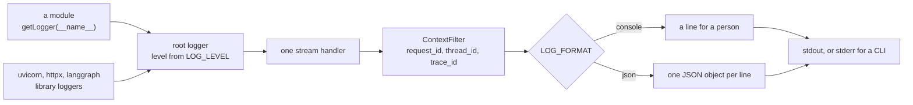

# Logging practices

How a Python application logs through the standard `logging` module: one config per process,
applied by its entry point; a constant message with the values as arguments; five levels with
narrow meanings; each exception logged once, where it is handled; and the request, dialogue and
trace ids on every line. The log shows what the application did. The text of prompts, answers
and documents stays in a trace store.

**Navigation**

- [What is here](#what-is-here)
- [How to adopt](#how-to-adopt)
- [The point to adapt](#the-point-to-adapt)

An arrow reads "hands the record to".

## What is here

- [logging.md](logging.md) — the rules, one section per topic: setup, writing a line, levels,
  exceptions, formatters, the request id, agents and the request's trace, summary lines, what never
  goes into a log, and checks. Read it before you add a log call, set up logging for a process,
  wire logging or tracing into a service or an agent, or add an HTTP route, a CLI command or a
  worker's job that calls a model.
- [setup-example.md](setup-example.md) — `core/logging.py` with its Filter and two formatters,
  the entry points of a FastAPI service and a CLI, a pure ASGI request-id middleware, a client and
  a use case at work, and what they print. Read it when you set up logging for a process.
- [agent-example.md](agent-example.md) — a LangChain agent whose run carries its dialogue and
  trace ids, writes one summary line, and logs a handled tool failure once; the optional
  middleware that logs each model and tool call. Read it when an agent's runs should appear in
  the log.
- [trace-example.md](trace-example.md) — one request that retrieves, runs an agent and writes a
  summary, traced as one trace under a root span with its input, output and attributes, and the
  same for a route that streams. Read it when you add a route that calls a model, or one request
  makes more than one model call.

## How to adopt

1. Copy this folder into your repository at `docs/engineering/python/logging/`.
2. Add one line to your `CLAUDE.md` or `AGENTS.md`: "Before you add a log call, set up logging for
   a process, wire logging or tracing into a service or an agent, or add an HTTP route, a CLI
   command or a worker's job that calls a model, read
   `docs/engineering/python/logging/logging.md`." Without it an agent never opens the file.
3. Copy `core/logging.py` and the two types in `core/schemas.py` from `setup-example.md`, add the
   `LOG_LEVEL` and `LOG_FORMAT` settings, and apply the config in each process's `main()`.
4. Turn on the ruff rules listed in `logging.md` section 11 in the linter your project already
   runs.
5. Re-check the lines that name a moving target: the FastAPI, Starlette and uvicorn versions in
   section 5; the LangChain middleware names, the Langfuse SDK v4 calls and the langfuse issues in
   section 8 and in `trace-example.md`; the Langfuse Cloud date in `production.md` section 5; the
   Agent Server's fields and the Sentry SDK version in section 12; and the ruff version in section
   11.

## The point to adapt

The trigger for the JSON formatter is yours. Start with the console formatter, and switch when
your logs go to a store that is searched by field. Everything else stays the same whichever you
pick: one config, one Filter, the same ids, the same levels, and no content in the log.

For the trace store, this folder strongly recommends Langfuse (`logging.md` section 8) and shows
it in `agent-example.md`. A team already on another trace store, such as LangSmith or plain
OpenTelemetry with any backend, changes the Filter's one trace-id function and
`core/langfuse_client.py`, nothing else.
