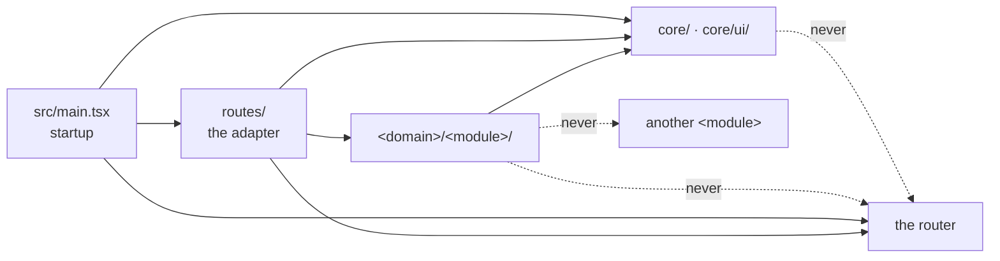

# React application architecture practices

How a React application is put together: the format that fits its pages, the tree as the React
case of [file-structure](../../any-language/file-structure/README.md), where state lives, how
server data is read and written through a query cache, routing, forms and errors, and which library
does which job.

**Navigation**

- [What is here](#what-is-here)
- [How to adopt](#how-to-adopt)
- [The points to adapt](#the-points-to-adapt)

An arrow reads "may import".

Why it is good: the arrows are the one direction of
[file-structure.md](../../any-language/file-structure/file-structure.md) section 2, as
[architecture.md](architecture.md) section 3 lays it out, with the import rules of its section 5;
the dotted edges are the imports the lint rejects.

## What is here

- [architecture.md](architecture.md) — the rules, one topic per section: the application format,
  the tree as the React case of file-structure and how it grows (scalability), file names, imports and the tool that checks their
  direction, a screen composed in its route, where state lives, reading and writing server data,
  routing and URL state, forms, errors and loading, TypeScript settings, the server-rendered case,
  the common mistakes with their fixes, where the rules stop holding, a review checklist and the
  sources. Read it before you choose an application's format, add a folder, a module or a route, or
  write a query, a mutation, a form or an error screen.
- [layout-example.md](layout-example.md) — the billing screens of `Acme Corp` as one worked layout:
  the tree, the first day of a new application, the configuration that makes the rules checkable, the startup file, the routes, one
  module's reads and writes, and what the checks caught. Read it when you start a React
  application, set up its checks, or write a module's first query and mutation.
- [libraries.md](libraries.md) — which library does which job, with the versions read on
  2026-10-01, and the lint, format, test and TypeScript tooling. Read it before you add a
  dependency or a tool.

## How to adopt

1. Copy this folder into your repository at `docs/engineering/react/architecture/`.
2. Add one line to your `CLAUDE.md` or `AGENTS.md`: "Before you choose a React application's
   format, add a folder, a module or a route, or write a query, a mutation, a form or an error
   screen, read `docs/engineering/react/architecture/architecture.md`; before you add a dependency,
   read `libraries.md` in the same folder." Without it an agent never opens the files.
3. The practice is the React case of `any-language/file-structure` and links it for every rule it
   owns. It also links `any-language/readability`, `any-language/refactoring`, `python/testing` (its
   `layout.md` and `what-to-test.md`) and the other folders under `react/`. Copy those folders too,
   or replace each link with your own rule for that topic.
4. Set up the checks of [layout-example.md](layout-example.md) section 3 with the first module, not
   later: the `@/` alias in `tsconfig.app.json` and `vite.config.ts`, the boundary rule, the ban on
   relative imports, the two rules that keep the router in `src/routes/` and `core/config.ts` in
   `src/main.tsx`, the file-name rule and Oxlint's barrel rule. Old code that breaks them reaches
   the practice the way [refactoring.md](../../any-language/refactoring/refactoring.md) section 4
   says, not by a rewrite.
5. Re-check the lines that name a moving target, all read on 2026-10-01 or 2026-10-02. Do it on the day you adopt
   the folder, when a trigger of [libraries.md](libraries.md) section 12 fires, and again by
   2027-04-01, six months after the reading; after that date, distrust every dated line until it is
   read again. The command `grep -rnE '2026-10-0[12]' docs/engineering/react/architecture/` lists the
   lines. [libraries.md](libraries.md), under when to re-check it, lists the triggers for the
   libraries.
6. Use the checklist of [architecture.md](architecture.md) section 17 as the architecture part of
   your review template.

## The points to adapt

- **The router.** The examples use TanStack Router. React Router 8 fits too; under its actions,
  writes go through actions, and the query cache comes later, if at all
  ([architecture.md](architecture.md) sections 9 and 10).
- **The case of component file names.** A team that wants a component's file to match the
  component takes PascalCase for its component files and sets that case in the file-name check;
  every other file stays kebab-case.
- **The alias.** `#/` subpath imports instead of `@/`, once every tool in the project runs on Node
  24.14 or newer.
- **The `staleTime`.** The example's 60 seconds is a choice. Set the number from how fast the data
  changes.
- **The tests.** The rules for testing a React application are not a practice yet;
  [libraries.md](libraries.md) section 6 gives the tools and a minimum.

What does not change: routes, then modules, then `core/`, with imports that point that way only
and a tool that checks them; modules that never import each other; one import path for each name,
absolute and direct; server data in the query cache, never copied; and one home for each kind of
thing.
