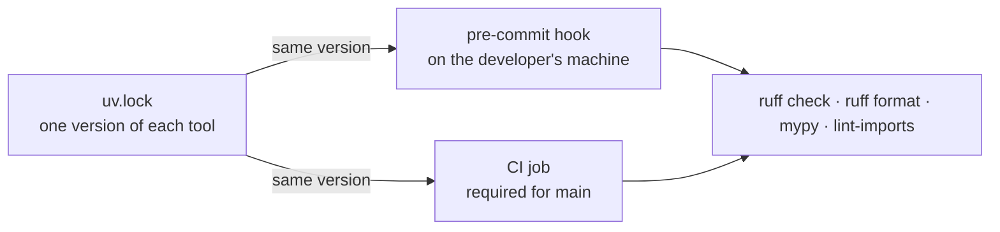

# Static check practices

How a Python repository runs the checks that read the code without running it: the formatter, the
linter, one type checker in strict mode and the import contracts. Each is one command from one
pinned version; CI runs it on every pull request and blocks the merge, and a light pre-commit hook
runs the same command earlier.

**Navigation**

- [What is here](#what-is-here)
- [How to adopt](#how-to-adopt)
- [The point to adapt](#the-point-to-adapt)

A plain arrow reads "runs".

## What is here

- [static-checks.md](static-checks.md) — the rules: which checks run, one pinned version per tool,
  what a hook may hold, CI as the gate, and how a suppression is written. Read it before you add or
  change a static check, a hook, the CI job that runs them, or a comment that silences one.
- [setup-example.md](setup-example.md) — `pyproject.toml`, `.pre-commit-config.yaml` and a CI
  workflow for a service, with each part explained. Read it when you set the checks up in a
  repository or change one of those three files.

## How to adopt

1. Copy this folder into your repository at `docs/engineering/static-checks/`.
2. Add one line to your `CLAUDE.md` or `AGENTS.md`: "Before you add or change a static check, a
   hook, the CI job that runs them, or a comment that silences one, read
   `docs/engineering/static-checks/static-checks.md`." Without it an agent never opens the file.
3. Copy the three files from `setup-example.md`, keep in `extend-select` only the rules of the
   practices you took, and make the CI job a required status check for `main`. Keep the
   `lint-imports` hook and its dependency only if you took file-structure, and copy its contracts
   from [layout-example.md](../file-structure/layout-example.md) section 3 before the first commit:
   without contracts, import-linter fails on every run.
4. In a repository that already has code, turn the type checker and each new rule on the way
   [refactoring.md](../refactoring/refactoring.md) sections 4 and 10 say, not by a rewrite.
5. Re-check the lines that name a moving target: the tool versions and the checker status in
   section 2 of `static-checks.md` (dated September 2026), the pre-commit `unsupported` rename, and
   the action versions in `setup-example.md`.

## The point to adapt

Which type checker is the gate is yours; [static-checks.md](static-checks.md) section 2 lists the
choices. The shape does not change: one checker, strict, its command in a hook and in a required
CI job, and one pinned version shared by both.
